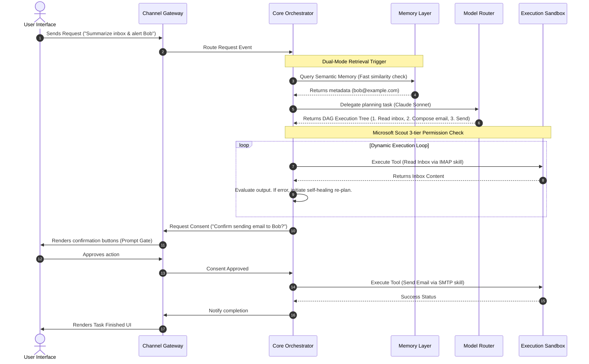
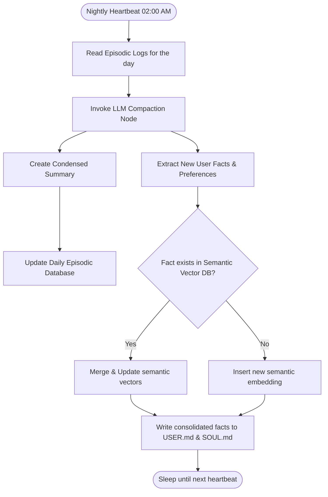

# Hydragent: Technical Architecture

This document describes the technical layout, layers, and operational flowcharts of the **Hydragent Unified AI Agent** architecture.

---

## 🗺️ 1. Core Architectural Layers & Footprint

Hydragent uses a modular, decoupled architecture where layers communicate asynchronously over a gRPC / HTTP2 event bus. The system is designed to build as a **hyper-optimized, systems-level Zig static binary** (<1 MB RAM footprint, 678 KB static binary size, <2 ms startup latency) utilizing vtable interfaces to swap memory engines, runtimes, and adapters dynamically without recompilation.

```text
┌─────────────────────────────────────────────────────────────┐
│ 1. Channel Gateway (Slack, Discord, Telegram, Web UI)        │
└──────────────┬──────────────────────────────────────────────┘
               │ Event Payload (JSON-RPC)
┌──────────────▼──────────────────────────────────────────────┐
│ 2. Event Bus & API Router (gRPC / HTTP2 Message Bus)        │
└──────────────┬──────────────────────────────────────────────┘
               │ Dispatched Task
┌──────────────▼──────────────────────────────────────────────┐
│ 3. Core Orchestrator (DAG Planner & ReAct Execution Loop)   │
└──────────────┬─────────────────┬────────────────────────────┘
               │                 │
┌──────────────▼──────────┐ ┌────▼────────────────────────────┐
│ 4. Memory Layer         │ │ 5. Model Router                 │
│  - Episodic (SQLite)    │ │  - OpenRouter API               │
│  - Semantic (ChromaDB)  │ │  - Local Ollama                 │
│  - Procedural (Skills)  │ │  - Dynamic Model Council        │
└──────────────┬──────────┘ └─────────────────────────────────┘
               │
┌──────────────▼──────────────────────────────────────────────┐
│ 6. Tool Dispatcher & Security Vault (Key injection)          │
└──────────────┬──────────────────────────────────────────────┘
               │ Scoped Permissions & TEE Isolation
┌──────────────▼──────────────────────────────────────────────┐
│ 7. Execution Sandbox (WASM runtimes, isolated Docker, MCP)   │
└─────────────────────────────────────────────────────────────┘
```

---

## ⚡ 2. End-to-End Execution Flow

This flowchart illustrates the lifecycle of a user request inside the Hydragent engine, highlighting the planning, verification, and execution stages:



---

## 🛏️ 3. Memory & "Dreaming" Pipeline

Memory is saved to a local SQLite database and a semantic vector database (e.g., ChromaDB). To maintain performance and avoid context bloat, the compaction process executes nightly:



---

## 🛡️ 4. Security & Cryptographic Sandboxing Specification

To implement *IronClaw / OpenFang* security constraints:

### Credential Boundary Injection
Credentials reside inside a memory-mapped, encrypted database (`secrets.json.enc`). When the orchestrator executes a tool (e.g., GitHub API calls):
1.  The orchestrator requests the dispatcher to make the API call.
2.  The tool specifies the endpoint and header placeholders (e.g., `Authorization: Bearer {{GITHUB_TOKEN}}`).
3.  The dispatcher retrieves the key from the vault, replaces the placeholder, and performs the network request.
4.  The credentials are wiped from the call parameters before logging execution traces.

### WebAssembly (WASM) Tool Runtimes
Non-network tools (e.g., calculator scripts, file parsers, data formatting logic) are compiled to WASM. They run inside the *Wasmtime* runtime, configured with:
*   Zero host filesystem access (or scoped to a single workspace folder).
*   Zero socket access (no network interface creation allowed).
*   CPU instruction limits (to mitigate denial of service loops).

### TEE Execution Enclaves
For cloud deployments, the Hydragent runtime environment is isolated inside hardware-level Trusted Execution Environments (TEEs) on the NEAR AI Cloud. All processes, keys, and memory buffers are encrypted in transit and at rest from boot to shutdown.
