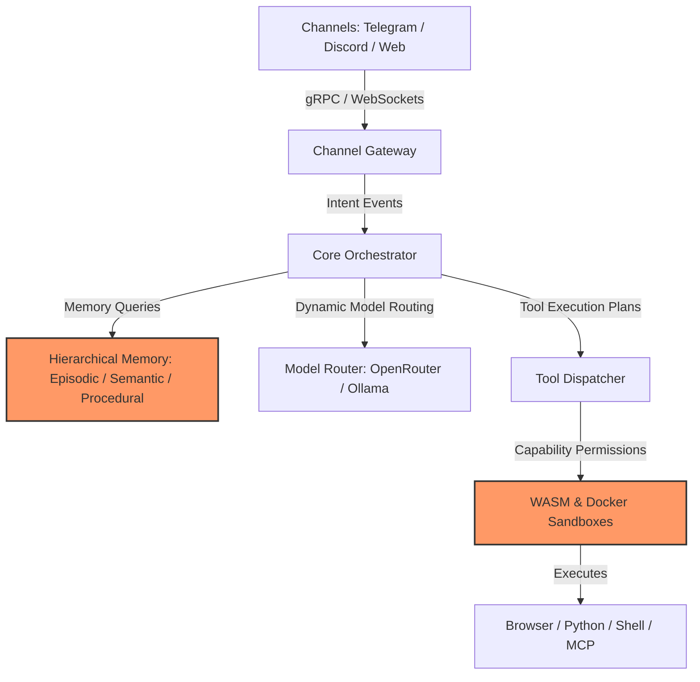

# Hydragent: The Unified AI Agent

> A next-generation, local-first, highly personalized AI agent combining the architectural strengths of today's best systems-level and autonomous platforms.

Hydragent is a modular meta-agent designed to consolidate the key innovations from the 2026 AI agent landscape. By separating orchestration, memory, security, and execution into distinct, pluggable interfaces, Hydragent achieves frontier-grade capability while remaining private-by-default, model-agnostic, and self-improving.

---

## 🌟 The Core Vision: Synthesis of Pros

Instead of building another single-purpose assistant, Hydragent extracts and integrates the best design patterns of current-gen systems:

*   **Systems-Level Runtime Foundations** (*from ZeroClaw / NullClaw*): Targets a ultra-lightweight, compiled Zig/Rust binary (~678 KB static binary size, <1 MB peak RAM usage, <2 ms startup latency) to ensure perpetual background execution at the edge.
*   **Self-Improving Skill Engine** (*from Nous Hermes Agent*): The agent code-generates its own tools (`SKILL.md`) based on past execution history and refines them recursively.
*   **Dreaming Memory Compaction & ReMe** (*from OpenClaw / QwenPaw*): A three-stage nightly sleep/consolidation loop paired with QwenPaw's ReMe framework (combining Vector searches with BM25 exact matching) for 88.78% QA accuracy.
*   **16-Layer Cryptographic Isolation** (*from IronClaw / OpenFang*): Supports Trusted Execution Environments (TEEs) on NEAR AI Cloud, an encrypted credential vault (XChaCha20-Poly1305), and mutual HMAC-SHA256 authentication. Secrets are injected at the host boundary—completely hidden from the LLM.
*   **Hierarchical Memory Engine** (*from memU*): Organizes memory into Files, Folders, and Mount Points, utilizing a dual-mode low-latency embedding trigger for continuous cost-efficient environmental awareness.
*   **Unified Multi-Channel Gateway** (*from OpenClaw / OpenFang*): Decouples presentation from execution, coordinating user I/O across 40+ distinct channel adapters (Telegram, Slack, Discord, WeChat, etc.) with per-channel formatting rules.
*   **Governed Shell Execution** (*from Microsoft Scout*): Incorporates a 3-tier permission matrix (Auto-approve, Prompt, Deny) linked with SGNL enterprise identity controls.

---

## 🗂️ Project Repository Layout

The project is organized into the following documentation structures to guide implementation:

```text
├── RaD/                   # Original research, development reports, and references
├── README.md              # Project overview, highlights, and quickstart (this file)
├── FEATURES.md            # Comprehensive feature matrix and capability catalog
├── ARCHITECTURE.md        # Technical specification of modular layers and API schemas
└── ROADMAP.md             # Phased milestones and implementation timeline
```

---

## 🏗️ 7-Layer Architecture Overview

Hydragent decouples cognitive operations from channel interfaces and model runtimes:



For a detailed breakdown of the execution flow, interface contracts, and schema layouts, see [ARCHITECTURE.md](file:///f:/Workspace(temp)/repo/ai%20agent/ARCHITECTURE.md).

---

## 🚀 Getting Started (Planned MVP)

### Prerequisites
*   Rust / Zig toolchains (based on target build binary options)
*   Docker (for sandbox isolation)
*   An OpenRouter API key (or local Ollama instance running Llama 3)

### Installation
```bash
# Clone the repository
git clone https://github.com/your-repo/hydragent.git
cd hydragent

# Build the systems binary (Zig target example)
zig build -Doptimize=ReleaseSafe
```

### Configuration
Configure your credentials in the secure env file:
```ini
OPENROUTER_API_KEY=your_key_here
LOCAL_OLLAMA_URL=http://localhost:11434
DATA_DIR=./data
```

For full setup procedures and available plugins, refer to the [FEATURES.md](file:///f:/Workspace(temp)/repo/ai%20agent/FEATURES.md) guidelines.

---

## 📄 License

Hydragent is open-source software licensed under the [MIT License](LICENSE).
