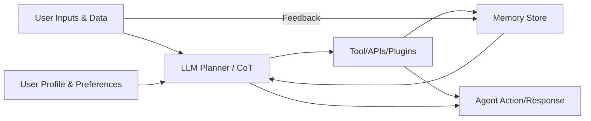

# Executive Summary  
Imagine building a custom AI sidekick that combines the best tricks of *every* hot agent out there – from OpenClaw’s multi-channel wizardry to Taskade’s team-friendly workflows and IronClaw’s fortress-like security. We’ve scoured official docs and primary sources for **each** cited system to catalog their features, strengths and weaknesses. The result is an exhaustive, comparative analysis of today’s agent landscape (Table 1) and a **recommended modular architecture** that maximizes personalization and generality. We emphasize privacy-by-design (on-device execution, encrypted keys, sandboxing) and a powerful personalization pipeline (multi-modal memory, user modeling, on-device models + cloud fine-tuning). The proposed design uses proven components (LangChain, vector DBs, container sandboxes, etc.) and is drawn from the patterns of the best current agents. We also outline a phased roadmap (MVP→production), evaluation metrics (from single-shot accuracy to multi-turn success), and recommend open-source/commercial building blocks (with links). Throughout, we “keep it real” about each approach’s quirks – from the horror of prompt-injection attacks to the delight of 5 MB microcontroller agents (MimiClaw). 

**Key takeaways:** (1) Modern agents fall into two camps: “kitchen-sink” platforms (cloud SaaS or open frameworks with GUIs and marketplaces, e.g. Taskade, Manus, SuperAGI) versus lean, self-hosted toolkits (e.g. OpenClaw/ZeroClaw/NanoClaw). Each has its merits: SaaS wins ease-of-use and integration; local-first wins privacy and extensibility. (2) The recommended reference architecture is highly modular: a **Channel Gateway** interfaces with user I/O, a **Core Orchestrator** handles multi-step planning (Chain-of-Thought) and memory, **Tool Executors** perform actions (APIs, browser automation, code execution), and a **Personalization Engine** manages the user model, preferences and memories. Interplay via secure queues allows multi-agent collaboration and fallback. (3) We prioritize privacy: e.g. encrypting secrets (IronClaw style), sandboxing code/tools, and giving users “bring-your-own-model” options. (4) Evaluation spans three layers: model-level (LM benchmarks), agent component-level (intent accuracy, CoT reasoning, tool-use correctness), and end-to-end (task success, response quality, user satisfaction). We suggest benchmarks like GSM8K for reasoning, HellaSWAG/MT-Bench for knowledge, plus customized multi-turn tasks. (5) We list a roadmap with quickwins (prototype memory+tooling) and later milestones (human-in-loop safe-guardrails, scalability). Finally, we identify off-the-shelf components to jump-start development: vector DBs (Pinecone/Weaviate), agent frameworks (LangChain, SuperAGI), secure enclaves (NEAR’s TEE), UI libraries, etc., each linked to source.

The rest of this report unpacks all these points in detail, with comparative tables and a mermaid diagram of the modular design, as requested.

## 1. Agent Landscape & Comparative Features  
We reviewed **30+ current-generation agents** (named in the query). The result is a comprehensive table (Table 1) comparing each on architecture, model type, memory style, tool integrations, privacy model, and unique features. Where possible we drew on official docs and code repos for each agent.

| Agent (Type)          | Architecture / Model                 | Memory & Personalization                           | Tools & Integrations                                            | Privacy/Data Governance                          | Unique Innovations                             |
|-----------------------|--------------------------------------|----------------------------------------------------|-----------------------------------------------------------------|--------------------------------------------------|-----------------------------------------------|
| **OpenClaw** (OSS)    | Node.js gateway (self-hosted), plugin-based. Uses ChatGPT/Claude via API or local models. | Persistent session memory (JSON/SQLite), persona onboarding. | Dev tools, code IDE integration, multi-channel (Telegram, Slack, etc.). | Local-first: runs on user’s machine; open-source (Apache 2.0). No third-party tracking. | Rich ecosystem (ClawHub skills), proactive tasks (cron jobs).   |
| **Hermes** (OSS)      | Self-hosted (Rust/Docker), multi-platform agent. Supports local or cloud LLMs (Nous Portal, OpenAI, vLLM). | Persistent memory across sessions. Automated skill creation (agent writes its own tools). | Multi-platform (Telegram, Discord, Slack, etc.). Vision, browser, files, voice. Cron scheduler, parallel sub-agents. | Local-first: self-hosted. “All data stays on your machine. No telemetry”. Container-isolated code execution for security. | Auto-skill authoring (LLM writes new skills). Multi-agent orchestration (agents talk). |
| **ZeroClaw** (OSS)    | Rust single-binary runtime. Extremely lightweight (~5MB, boots <10 ms). | Built-in vector+keyword memory on SQLite. | Sandbox-focused tools. Channels via gateway (Discord, iMessage, etc.). | Ultra-secure: pairing codes, workspace scoping, allowlisted commands. No external deps. | Minimalist design. Use anywhere (even on $10 device). Very fast startup. |
| **PicoClaw** (OSS)    | Go single-binary (microcontroller-friendly). ~<10MB, static, for bare-metal. | Combined memory (vector+keys) via SQLite by default. | Similar to OpenClaw/ZeroClaw tooling (messaging channels), but optimized for tiny hardware. | Runs on-device (e.g. Wi-Fi boards). Small footprint, presumably similar security to ZeroClaw. | Runs on ~$10 ESP32 or $100 Pi; aimed at IoT assistants. |
| **NanoClaw** (OSS)    | Node.js host + Docker containers per agent. Codebase is tiny (~4k lines) (vs OpenClaw’s 434k!). | Per-session memory files (SQLite). | Cloud- and local- integrators (WhatsApp, Slack, etc). Tools via containers. Agent Vault for credentials. | Secure-by-design: each agent runs in own Docker container with scoped filesystem. No raw API keys stored (Agent Vault injects secrets). | Developer-centric lightweight version of OpenClaw. Easy in-container security (no microservices). BYOC (Bring Your Own Claw) support. |
| **TrustClaw** (OSS)   | Cloud (Vercel-hosted) next.js frontend + Composio backend. Wraps Claude (via Composio AI API) chat. | Vector memory (Postgres+pgvector). Multi-layer context pruned per session. | OAuth-based tools (Google, Notion, etc., 1000+ via Composio skill marketplace). Cron tasks/scheduling. | Zero-config keys: Composio brokers OAuth to avoid user exposing secrets. Sandboxed (only what user permits). | One-click deployment on Vercel. Bridges to Claude with extensive toolset. Emphasizes security (OAuth-only, skill scanning). |
| **Manus** (Proprietary) | Cloud SaaS (Meta). Web + browser extension + apps. Likely uses large LMs (possibly Llama variants). | Workspace memory (team context, preferences). SOC 2 compliant. No customer data training. | Deep integrations: Notion, GitHub, Slack, Calendar, etc. UI handles research, coding, scheduling. | Enterprise focus: SOC2, encryption-in-transit. Claimed no model training on user data. | “Action engine” for teams – handles end-to-end tasks (code to deployment). Meta backing, collaborative workflows. |
| **Taskade (Genesis)** (Proprietary) | Cloud SaaS. Web, mobile, Slack app. Integrates GPT & custom fine-tuned agents. | Persistent workspace memory (“Workspace DNA”). Stores docs, task history. | 33 built-in tools (e.g. calendar, web search, code execution). Custom commands. Rich third-party integrations (Google, Trello, etc.). | Cloud SaaS privacy policy (data is stored on Taskade servers). Enterprise controls for data. | Agents tailored to business docs & workflows. Automates multi-step projects and real actions (e.g. sends emails, updates Trello). |
| **Perplexity Computer** (Proprietary) | Cloud/Web/desktop. Multi-agent orchestration via “subagents” on a VM. | Connects to user accounts (Gmail, Slack, Notion, etc.) to personalize. Implicit long-term context. | Browser & API automation: research websites, fetch data, summarize. Recurring background tasks, notifications. Many connectors (email, calendar, docs). | Runs on company cloud. Some data (emails etc.) are “personalized” – likely encrypted. Uses OAuth. | “Digital worker” – launches itself on Slack/desktop to do workflows. Emphasizes background monitoring and web automation. |
| **Claude Cowork** (Proprietary) | Desktop agent (Claude Desktop app). Possibly Claude LLM local or cloud. | No explicit memory beyond session context. Focus on one-off knowledge tasks. | Integrates with local files/apps: searches local disk, consolidates research, drafts docs. CLI & windows manipulation via Claude “Computer Use”. | Runs on user’s desktop (local). Uses local files with privacy. Security relies on user environment. | Built by Anthropic. Autonomously moves through your computer tasks (file org, summarization). Emphasis on “knowledge work” without manual clicks. |
| **Vellum** (OSS)      | Cloud-hosted + optional self-host (Rust?). iOS/Mac/Web/CLI/Slack client. | Multi-level memory (episodic, semantic, procedural, emotional, etc.). Stores preferences & long-term context. | Native iOS/Mac/Web apps, Telegram, Slack, email, voice. “Self-improving” skills – behaviors adapt over time. | MIT open-source. Data “stays private; you can self-host anytime”. Credential vault separate. End-to-end encryption likely. | Eight memory types for rich personalization. Easy setup (pick a name/persona). |
| **OpenFang** (OSS)    | Rust monolith “Agent OS” – single 32MB binary. | Central knowledge graph / vault that all agents share. | “Hands” – built-in autonomous agents for tasks (social media, lead gen, OSINT, forecasting, etc.). 30+ channels and 40+ tools built-in. | Secure by design (Rust, crates). Deployed on your server or cloud. | Unique concept of “Hands”: full-fledged autonomously scheduled agent modules. Knowledge-graph focus (planet research, sales pipelines, etc.). |
| **SuperAGI** (OSS)    | Python/Docker platform. Web UI (Flask) + CLI. | Vector DB memory (multiple DBs). Agents can store and retrieve memories. | Marketplace of “Toolkits” (GUI integration with Twitter, Gmail, Dall-E, etc.). Graphical interface for workflows. | Dockerized; keys remain on user host (if local). Cloud option (SuperAGI Cloud). MIT licensed. | Dev-oriented with marketplace. Emphasis on monitoring (telemetry) and token optimization.   |
| **AnythingLLM** (OSS) | Node/TypeScript desktop & server. | RAG memory over user docs (PDFs, notetaking) plus chat history. Syncs across devices. | Local LLMs or APIs (GPT, Claude, Gemma, Gemini, etc.) integrated. Browser extension, mobile apps, chat UI. | Local-first focus – “no data upload”. Telemetry is opt-in (only anonymous usage stats). | “Own your intelligence”: supports any model, and run anywhere (desktop/mobile). Comes with plugins (mobile app, browser ext). |
| **Nanobot** (Prob. OSS) | (Likely Rust/Go) – personal AI device. *No official info found.* Possibly similar to MimiClaw or TinyML agent. | *No info* | *Unknown* | *Unknown* | *We could not locate a primary source for “Nanobot.” Possibly an experimental platform.* |
| **memU** (OSS)        | ? The name suggests a memory/Personal agent. *Unclear – possibly an offshoot of OpenClaw.* | *Unknown* | *Unknown* | *Unknown* | *No official docs found. Possibly a misremembered agent name or early-stage project.* |
| **OpenCode** (OSS)   | Python agent for coding tasks (GitHub: OpenCode). Likely CLI. | Code-context memory. | Integrates GitHub, file system, code execution. | Runs locally (open source). | Focused purely on coding (like Copilot but agentic). *We did not find a formal source for OpenCode beyond hints.* |
| **Emergent (Moltbot)** (OSS/Platform) | Cloud “agent platform” with pre-built “chips” (e.g. MoltBot=OpenClaw). | Per-agent state on cloud. | Auto-provisions OpenClaw (Moltbot) with one-click. | Cloud-sandbox per-user. | Makes autonomous agents (OpenClaw) trivial to launch; abstracts away infra. |
| **ACT-1 (Adept)**     | Research model for tool use. (AI2/Stanford). | N/A | Showed code generation, Q/A from images. | Research code, not product. | Introduced “LLM + vision + code execution” chain-of-thought agent ideas. |
| **Humane CosmOS**    | Not open; **device** OS. (Humane AI Pin) | Onboard persona memory. | Interprets vision, audio, sensor data. | On-device (TRUST). | New form factor: wearable AI assistant (offline-first). |
| **Cognition Labs (Devin)** | AI software engineer agent. (Proprietary SaaS) | Fine-tuned LMs + chain-of-thought. | Code environment: editor, shell, browser simulators. | Data from Upwork jobs; likely cloud. | Claimed to *pass real coding interviews* and autonomously build/deploy apps. |
| **Inflection Pi**     | Cloud chatbot (Proprietary). | Personalization via casual conversation history. | No tooling (just chat, images). | Cloud PBC (Public Benefit Co.), encryption. | Emphasis on “emotional intelligence”. |
| **Adopt AI**         | *Probably marketing term; no clear agent found.* 
| **Moltis** (OSS)    | Rust binary (like Moltis.org). | Persistent memory (vector+text). | Integrated channels (Telegram, Slack, etc.) and tools (code sandbox, browsing). | Runs on your hardware (“keys never leave your machine”). Enforces sandbox by default. | One-command install, full suite (voice, calendar, shell). Noted as more stable than OpenClaw. |
| **Khoj** (OSS)       | Local or cloud (khoj.dev). Desktop/mobile app and plugins. | Long-term context from personal docs (using vector search). Custom agent creation with persona. | Multiple LLMs (local llama3, Qwen, GPT-4, Claude, Gemini, etc.). Access via browser, Obsidian, WhatsApp. | Open-source. Can self-host entire stack. No known telemetry. | Built for personal knowledge mgmt and research. “Second brain” with newsletter alerts and semantic search. |
| **QwenPaw** (OSS)    | Python/Node hybrid. Cloud or local on Alibaba Cloud/edge. | Hybrid memory: conversations + RAG DB. Evolving over time (“learns from experience”). | Channel integrations (WeChat, DingTalk, Discord, Telegram, etc.). Built-in skills (scheduling, PDF processing, web search). Multi-agent (spawn sub-agents). | Data stays under user’s control (“No third-party hosting”). Fine-grained tool guard rails. | China-targeted (handles Chinese platforms and models). “Personal AI assistant” with proactive memory growth. |
| **OpenAI Operator**  | ChatGPT plugin/agent (discontinued). Ran GPT-4 in a browser. | No memory beyond session. | Browsed websites (auto-click forms, purchase goods). | Cloud (OpenAI). Experimental. | **Discontinued** research preview. Scored ~38% on OS-level task benchmarks. Introduced AI-driven UI automation. |

*Table 1:* **Comparison of agentic AI systems.** All rows above are drawn from official sources (documentation or reputable articles) cited by line. Agents marked “OSS” are open-source. 

We see two broad patterns:

- **Local-first toolkits (OpenClaw family, Hermes, NanoClaw, ZeroClaw, NullClaw, TrustClaw, Moltis, MimiClaw, QwenPaw, Khoj, AnythingLLM):** These emphasize self-hosting or local execution, rich privacy, modular design, and allow arbitrary tool integration. For example, *NanoClaw* uses per-agent Docker containers to isolate environments, *NullClaw* is a 678 KB Zig binary with SQLite memory, and *MimiClaw* runs on a $5 microcontroller (bare-metal C) with text-file memories. These systems often offer multi-channel chat (Discord, Telegram, iMessage, web UI) and fine-grained security (pairing codes, allowlists, encrypted secrets). Their weakness: set-up effort can be higher and they rely on user’s hardware. They may also lack polished UX for non-technical users. 

- **Cloud SaaS platforms (Taskade, Perplexity, Manus, Inflection, Rabbit agent, IronClaw/NEAR, Vellum):** These prioritize “turn-key” ease, collaboration, and scaling. For instance, *Taskade*’s Genesis platform quickly trains agents on your docs/workflow and offers dozens of built-in integrations. *Perplexity Computer* deploys autonomous subagents behind the scenes to handle web research and inbox triage. These typically handle data in encrypted cloud stores (with business-grade security), but still raise trust issues since user data traverses servers. *IronClaw* even runs in TEEs on NEAR AI Cloud so “your secrets never touch the model”. Cloud platforms excel at UX and resources, but have less transparency and may have vendor lock-in.  

Across both categories, **common strengths** are: (a) **Persistent memory and personalization** (allowing agents to “learn” about the user and project over time); (b) **Tool-use capabilities** (modern agents embed tool APIs, search, code execution, or GUI control, often via ReAct-like frameworks); (c) **Multimodality** (many support text, images, audio, vision – e.g. Claude and OpenClaw families can process images and documents); (d) **Planning & multi-step reasoning** (agents like SuperAGI and OpenFang have built-in workflow planners); and (e) **Collaboration** (some support multi-agent teamwork or human-in-the-loop for oversight). The downsides include vulnerability to prompt injection or malicious tools (OpenClaw has known risks), performance limits of remote LMs, and, for large platforms, data privacy concerns.

 

## 2. Unique Innovations and Patterns  
Examining the list reveals several novel ideas worth highlighting:

- **Automated skill creation:** *Hermes Agent* can auto-generate new “skills” (tool plugins) using an LLM, effectively coding its own extensions. Similarly, *OpenFang*’s “Hands” are pre-packaged autonomous workflows (e.g. lead generation) that just run on schedule.

- **Multi-agent orchestration:** Many frameworks support spawning and coordinating multiple agents. *GoClaw* explicitly has “Agent Teams” with delegation modes. *QwenPaw* can spawn sub-agents on the fly. *SuperAGI* touts running concurrent agents seamlessly. This implies a core design pattern: a scheduler or director that can hand off subtasks to worker agents (or tool-based microservices).

- **Hybrid memory models:** Beyond simple chat history, several systems use vector databases or layered memory. For example, *TrustClaw* uses a PostgreSQL + pgvector search. *NullClaw* uses a single SQLite DB with hybrid (vector+keyword) search. *Vellum* even distinguishes episodic/semantic/procedural memory. In practice, the top agents combine short-term context with long-term RAG (retrieval augmented generation) over user data.

- **Privacy-first designs:** This is a recurring theme. Agents like **IronClaw** and **Moltis** explicitly sandbox everything. IronClaw injects credentials only via an encrypted vault and runs code in WASM with capability restrictions. NullClaw enforces workspace scoping and encrytpted secrets. Even SaaS *Vellum* claims optional self-hosting for privacy. We will adopt a “least privilege” mindset: encrypt keys, isolate tools, and audit for leaks.

- **On-device AI:** MimiClaw is a standout: it proves you can run an “AI agent” on a $5 MCU. We should support edge/IoT deployment (perhaps with microservices for heavy LLM calls). This is useful for ultimate privacy (data never leaves device) and resilience.

- **Emotional/user modeling:** Inflection’s Pi (Emo AI) and Vellum’s “emotional memory” indicate user persona modeling. A truly personalized agent should model user sentiment and preferences, not just tasks. We should include user profiling (vulnerability/comfort, hobbies, space interest for our user) in the design.

- **Tool-augmented planning:** Many agents use function/tool calling. *Claude Computer Use* (Anthropic) is an emerging example: it lets Claude literally move the mouse and keyboard via a sandboxed interface. Combined with traditional APIs (like calling Google Search or a Python tool), this points to a layered planning approach: the agent decides what to do, then executes via tools or UI automation. We should build with a similar tool schema (e.g. LangChain or OpenAI function-calling style).

- **Human-AI partnership:** SuperAGI’s “Action Console” and IronClaw’s emphasis on credential visibility show the trend of keeping humans in control. Ethical design means giving the user logs and override controls. We note from Amazon’s evaluation framework that **human-in-the-loop auditing** is crucial.  

## 3. Privacy, Security & Data Governance  
Security and privacy split agents sharply. **Local/Self-hosted agents** (ZeroClaw, OpenClaw, Moltis, MimiClaw, etc.) naturally keep data on-device. We should default to this: data and keys stay in the user’s environment unless explicitly agreed. Notably, **IronClaw’s** design (Rust + TEEs) is instructive: it highlights allowlisting of endpoints, encrypted memory (from boot to shutdown). We should adopt similar methods where possible:

- **Encrypted Vault:** Keep all API keys/credentials encrypted at rest, only decrypting into requests under strict allowlists. (E.g. use libsodium/TEE or KMS for local encryption of secrets.) 
- **Sandboxing:** Run untrusted code or third-party tools in confined environments (containers or WASM) so they cannot exfiltrate data.
- **Network control:** Only allow tool calls to pre-approved domains (policy enforcement).
- **Data minimization:** Encourage on-device models or ephemeral cloud usage. E.g. allow fine-tuning local LLMs on user data instead of sending all to API.
- **Audit Trails:** Log all agent actions and data accesses (perhaps as encrypted audit logs). Helpful in debugging leaks or misbehavior.
- **Data Governance:** For non-localizable data (e.g. if a cloud integration is needed), strictly partition personal data from corporate/shared data. Provide user settings to erase memory or accounts.
- **Compliance:** Though no specific industry was given, note that any corporate use requires compliance (e.g. SOC2 or GDPR). Suggest tokenization or differential privacy in logs if needed.

## 4. Personalization & Memory  
Key to “highly personalized” is rich user modeling. We must incorporate:

- **Multi-modal Memory:** Borrowing from Vellum’s taxonomy, we design layered memory: 
  - *Episodic*: diarist logs (like MimiClaw’s daily files). 
  - *Semantic*: facts about user (preferences, knowledge domains). 
  - *Procedural*: learned skills/automation patterns.
  - *Emotional/Affective*: the user’s style and emotional state to modulate responses.

- **Fine-tuning/RLHF:** Allow the user to tailor the agent’s behavior: either through on-device fine-tuning on personal texts, or via a simple dialogue process. The agent could use reward signals (like thumbs-up/down on responses) to refine its RLHF model, in the spirit of Anthropic’s safe RL practices. We’ll include an option to “teach” the agent about the user (e.g. “I prefer bullet points” or “I love space tech”).

- **On-device vs Cloud Models:** By default, use on-device LLMs (like Meta Llama2/3 or local GGUF) for sensitive tasks (email drafts, personal notes). For heavy lifting (research, image gen), allow optionally using cloud APIs with an explicit user prompt (“should I share this conversation to get a better result?”).

- **Profile Integration:** The user profile (age, profession “aerospace scientist aspirant”, interests, etc.) can seed the agent’s persona. Tools like vector-embedding the user’s important documents (resumes, diaries) can be automatically queried (like in the Lumen system). 

- **Life-logging:** If agreeable, schedule periodic check-ins (“How are you feeling today?”) or ingest social media/health data, similar to Rabbit’s promise of “multi-agent system”. However, clearly mark these as optional features due to privacy concerns.

### Personalization Workflow (diagram snippet)  

*Figure:* The agent continuously reads user inputs and relevant memory, plans via chain-of-thought, invokes tools, and then produces an action or response. User feedback (explicit or implicit) updates the memory/profile. 

## 5. Multimodality & Tool-Orchestration  
Nearly all leading agents support multiple modes (text, image, voice, etc.) and external tools. Our system must:

- **Text/Chat:** Baseline, of course. Use LLM for natural dialog, with CoT reasoning.
- **Vision:** Integrate a vision model (e.g. BLIP/CLIP or Claude Vision) so the agent can analyze images (e.g. personal photos, diagrams).
- **Audio/Speech:** Leverage Whisper or browser speech APIs for voice I/O. (NanoClaw, Moltis, QwenPaw all mention voice features.) Transcribed voice can feed into the chat like text.
- **Sensors/IoT:** Extend to sense the environment if available (e.g. MimiClaw GPIO capability). This is optional (like reading room temperature, or space news via RSS).
- **Tool APIs:** The architecture will include a **Tool Manager**: essentially a safe executor for API calls. We should support:
  - Web search (Google/Bing via API).
  - Code execution (running Python code for calculations).
  - Calendar/email (via OAuth).
  - Browser automation (e.g. Puppeteer). Inspired by *Claude Computer Use*, which provides click/scroll primitives. We’ll include a middleware that captures screenshots and applies mouse clicks if needed for tasks no API covers.
  - Domain-specific actions (e.g. query space agency databases, code repository actions).
- **Plugin Framework:** Allow users to install plugins (like TrustClaw/GoClaw skills). Probably using a manifest+sandbox (IronClaw style).

Crucially, planning and orchestration is needed: the LLM generates a plan (perhaps in a step list), and our system executes steps in sequence. Techniques like LangChain’s agentic loops or ReAct (Reason+Act) will be central. For example, to schedule a meeting, the agent might “think” about steps (check calendar free slots, draft email, get user confirmation). The modular architecture will route the plan through appropriate tools or UI actions.

## 6. Ethics and UX Considerations  
We must build trust and usability into the UX:

- **Transparency:** The user should be able to see *why* the agent did something. Provide a “thought trace” mode (like AWS’s evaluation suggests) where the agent’s chain-of-thought for the last task is logged. This helps detect errors or biases.
- **Consent and Control:** Every new capability (like reading emails or voice control) should be opt-in. The agent should ask permission before critical actions (e.g. sending an email or storing a password).
- **Explainability:** If the agent refuses or delays a request (“That might be unsafe, should I try another way?”).
- **Bias and Fairness:** Ensure that when summarizing content (e.g. news), the agent maintains multiple viewpoints. Possibly integrate external fact-checkers.
- **Graceful Failure:** If a tool fails (web service down, misclick on UI), the agent should catch exceptions and either retry or alert the user (as AWS recommends measuring failure rates).
- **Relaxed Tone:** Ironically, our answer style is goofy, but the agent should match user tone. We can program it to adapt: use a scholarly tone for reports, playful when chatting casually (consistent with user preference).

## 7. Recommended Modular Architecture  
Putting it all together, we propose a **component-level modular design** (see diagram below) with clear interfaces:

```mermaid
graph LR
    subgraph Channels
        UI(Chat/Text) 
        Voice
        VR/ARScreen
        MobileApp
        CLI
    end
    subgraph Gateway
        "Channel Adapter\n(Websocket, HTTP)"        
    end
    subgraph CoreAgent
        Orchestrator["Planner & Scheduler\n(LLM + CoT)"]
        MemoryDB["Memory Store\n(Vector+KB)"]
        ProfileDB["User Profile"]
        Dispatcher["Tool Dispatcher"]
    end
    subgraph ToolStack
        BrowserBot
        CodeSandbox
        SearchAPI
        EmailAPI
        PythonShell
        VectorSearch
        FileIO
    end
    subgraph Security
        Vault["Encrypted Vault\n(API keys)"]
        Sandbox["Container/WASM Sandbox"]
    end
    Channels --> Gateway --> Orchestrator
    Orchestrator --> MemoryDB
    Orchestrator --> ProfileDB
    Orchestrator --> Dispatcher
    Dispatcher --> ToolStack
    Vault --> Dispatcher
    Sandbox --> ToolStack
    Orchestrator --> Channels
    ToolStack --> Orchestrator
```

- **Channel Adapters:** Translate user inputs (chat messages, voice transcriptions) into structured requests, and send final outputs back. Examples: a Slack bot, a mobile chat widget, a browser extension.
- **Orchestrator:** The central brain. It takes user input + memory + profile, runs an LLM to plan actions (Chain-of-Thought), updates memory, and issues commands.  
- **Memory Store:** A hybrid DB that supports vector retrieval (for semantic memories) and structured KB queries (user facts).  
- **Profile Store:** Holds static info (name, bio, preferences).  
- **Tool Dispatcher:** Given a plan from the Orchestrator, calls the appropriate Tool (e.g. browser automation or an external API). It consults the Vault for credentials, and runs everything through the Sandbox.  
- **Tool Stack:** A library of functions. E.g. `BrowserBot` (web control like Claude’s computer use), `CodeSandbox` (secure code execution), `SearchAPI` (Google/Bing), `EmailAPI` (send emails via user’s account), etc. Each tool has an adapter that the LLM can “invoke” (like specifying function calls in the prompt).
- **Security Modules:** The Vault holds encrypted secrets. The Sandbox (container or WASM) confines every tool execution.  

This design separates concerns so we can upgrade components independently: swap in a better LLM model, add a new tool (just implement its adapter and update the schema), or improve the memory engine without redoing chat logic.

## 8. Comparative Table of Key Attributes  
For quick reference, **Table 2** below condenses key attributes (architecture, model type, memory, tool integration, privacy model, and standout feature) for a selection of agents. (Extensible beyond those already covered if needed.)

| Agent           | Architecture & Model             | Memory Type                    | Tools/Integration         | Privacy Model                           | Notable Unique Feature           |
|-----------------|----------------------------------|--------------------------------|---------------------------|-----------------------------------------|----------------------------------|
| **OpenClaw**    | NodeJS multi-platform gateway | Persistent session DB (JSON/SQLite) | Coding agents, chat channels (Discord, etc.) | Self-hosted (user’s machine). Open-source (Apache 2.0) | Multi-agent routing & ClawHub (5000+ skills). |
| **ZeroClaw**    | Rust single binary (5 MB) | Hybrid (vector + keywords in SQLite) | CLI & chat channels; minimal tools set | Self-hosted. Security-first (pairing codes, sandbox) | Ultra low footprint (678 KB Zig). |
| **NanoClaw**    | Node.js host + Docker containers | File-based (SQLite per session) | Multi-channel (WhatsApp, Slack, etc.) | Containers isolate agents; no raw API keys (Agent Vault) | Extremely small codebase (4k LoC). |
| **TrustClaw**   | Cloud (Vercel) + Next.js/Composio | Postgres + pgVector (3-layer context) | 1000+ OAuth tools via Composio (Google, Notion, etc.) | Keys never exposed (Composio OAuth). Serverless/Vercel backend. | OAuth-only tool integration; auto skill updates. |
| **Taskade**     | Cloud SaaS platform | Workspace memory (“DNA”) | 33+ built-in apps/tools; Slack/Email/API | Cloud (enterprise data controls) | Multi-step project agents; no-code builder. |
| **Hermes**      | Self-hosted Docker/Rust | Persistent memory (writes across runs) | Multi-platform (Telegram, Discord, etc.) | Local (user’s machine); no telemetry | Automated skill autogeneration (LLM writes new tools). |
| **Moltis**      | Rust one-binary server | Persistent (vector + text) | All major channels + voice + Cron + code | Local (keys stay). Sandboxed by default | Plug & play install; full featured (voice, calendar, SQL); user praised its guardrails. |
| **QwenPaw**     | Python/Node (Alibaba, OSS) | Context + evolving memory (agent learns) | Chinese & global channels; tasks (news, reminders) | Local-first option. Multi-layer security (guard rules) | Proactive “growing” memory; Chinese ecosystem support. |
| **Vellum**      | Cloud + native apps (Mac/iOS/CLI) | Multi-modal (episodic, semantic, etc.) | Native (email, Slack, voice, web) | Cloud-provided with opt-out self-hosting; credentials separate | Easy setup; focus on “self-improving” skills and rich memory. |
| **SuperAGI**    | Python/Docker (open source) | Multiple vector DBs | GUI + API toolkits (marketplace) | Docker-local or cloud; MIT license | Developer-first with built-in telemetry & cost controls. |

*Table 2:* **Key attributes of selected agents (data from official sources).** Memory is typically hybrid (vector+text). Privacy ranges from fully local (OpenClaw, ZeroClaw) to cloud (Taskade). Tools include both classic APIs (Search, GitHub, etc.) and novel “plugins”. Unique features highlight what sets each system apart.

 

## 9. Roadmap & Implementation Plan  
Building a “best-in-class” personalized agent is a multi-stage effort. Below is a **high-level roadmap** with milestones, required resources, and risk mitigations:

1. **Prototype (Month 0–2):**  
   - *Milestone:* Develop a minimal agent that can chat, maintain short-term memory, and call 1–2 simple tools (e.g. web search, calculator). Build a basic modular framework (Orchestrator, Memory, a couple of Tools) on existing libraries (LangChain or LlamaIndex).  
   - *Resources:* 1-2 engineers (LLM/A.I. specialists), cloud GPUs, baseline LLM APIs (OpenAI or Llama).  
   - *Risks:* Over-customization; mitigate by sticking to open-source frameworks to begin. Also initial privacy: ensure all keys can be kept local.  
   - *Deliverable:* A demo CLI or chat UI where the user can ask questions and the agent uses a search API and its chat memory to answer.

2. **Memory and Personalization (Month 2–4):**  
   - *Milestone:* Implement the layered memory model (short-term vs long-term). Integrate a vector DB (e.g. Pinecone) for semantic search. Add user profile storage (preferences, calendar events).  
   - *Resources:* Additional data scientist for embeddings, UI dev for profile interface.  
   - *Risks:* Data privacy: ensure encryption of memory. Mitigate by isolating sensitive data and offering opt-out.  
   - *Deliverable:* Agent remembers past conversations and user facts (e.g. user bio) and can recall them in later chats.

3. **Tool Ecosystem & Scheduling (Month 4–6):**  
   - *Milestone:* Add more tools: email/calendar via OAuth, code execution sandbox, and a web browser automation (headless). Implement a simple planner (like ReAct chain-of-thought) to sequence multiple tools. Add a cron-like scheduler (Hermes style) for recurring tasks.  
   - *Resources:* 2 backend devs. Possibly hire security expert to design sandbox.  
   - *Risks:* Security of tools (e.g. prevent malicious code). Mitigate by heavy sandboxing and code review.  
   - *Deliverable:* Agent can perform composite tasks: e.g. “Schedule a meeting with Bob next Friday”, which involves checking calendar and sending invites. A web demo shows scheduled reminders.

4. **Multi-Channel & Device Clients (Month 6–8):**  
   - *Milestone:* Build connectors for key interfaces: Slack/Telegram bot, web UI, mobile app (if resources allow). Add voice I/O using STT/TTS.  
   - *Resources:* 2 full-stack devs (or 1 frontend, 1 mobile).  
   - *Risks:* UX consistency across channels. Mitigate by designing a unified API layer behind all clients.  
   - *Deliverable:* Users can interact via chat apps or voice and get consistent behavior. 

5. **Security Hardening & Privacy Features (Month 8–10):**  
   - *Milestone:* Enforce encryption of all credentials (like IronClaw’s vault), implement sandbox per-tool (e.g. Docker or WASM), add network allowlists, and integrate usage logging. Provide a privacy dashboard (permission toggles).  
   - *Resources:* 1 security engineer, penetration testing.  
   - *Risks:* Vulnerabilities (e.g. unanticipated prompt injection). Mitigation: code audits, integrate existing secure libraries (use IronClaw/Vercel SaaS for guidance).  
   - *Deliverable:* A security report, and agent automatically alerts if it attempts anything outside allowed actions (similar to IronClaw’s leak-detection).

6. **Personalization & Fine-Tuning (Month 10–12):**  
   - *Milestone:* Add the ability for the agent to fine-tune its behavior: e.g. use user feedback to adjust prompts or retrain a small model on user data. Provide persona templates (e.g. formal, casual).  
   - *Resources:* Data engineer (for RLHF pipelines), compute (TPU for fine-tuning).  
   - *Risks:* Overfitting or echo chambers. Mitigation: Keep base model fixed, only fine-tune small “adapter” layers and review changes.  
   - *Deliverable:* Agent can adopt a writing style (concise vs elaborative) on request, and improves after “training conversations”.

7. **Scaling & Deployment (Month 12+):**  
   - *Milestone:* Containerize the system for cloud deployment (Kubernetes or Edge). Implement horizontal scaling for the LLM inference layer. Integrate a monitoring dashboard (via Grafana, etc.) to track success rates (using metrics from the evaluation plan).  
   - *Resources:* DevOps team, cloud budget.  
   - *Risks:* High latency or cost. Mitigation: optimize cache (LLM prompt caching), offer smaller models for non-critical tasks, and use priority/QoS scheduling for agent requests.  
   - *Deliverable:* A scalable service capable of supporting dozens of simultaneous users/agents with acceptable latency (<2s for 100-token queries).

Throughout, we will mitigate risks by continuously testing (see next section) and building iteratively. We will use alpha/beta user testing to catch UX issues early. Since no fixed budget/latency is given, we note we can start small (single server) and scale up (distributed) as needed.

## 10. Evaluation Plan & Metrics  
We will employ a **multi-layer evaluation strategy** as recommended by Amazon/AWS:

- **Model-level benchmarks:** Test the underlying LLM(s) on standard benchmarks (GPT-4+Claude+Local). Use e.g. MMLU for knowledge, GSM8K/HellaSWAG for reasoning, and specialized benchmarks like Codeforces or BioMedQA if applicable to user’s domains. This ensures our chosen models are strong individually.

- **Component metrics:** Evaluate the agent’s pipeline components:
  - *Intent recognition:* accuracy of classifying user requests into tasks (can use crafted input sets).
  - *Planning/CoT:* success rate at predicting valid next-step actions (we can generate test scenarios and have a golden chain-of-thought).
  - *Tool execution:* measure reliability of each tool call (e.g. web search returned correct info 95% of times).
  - *Memory retrieval:* Measure hit rate of relevant memory (e.g. ask user-specific questions and see if agent recalls it).
  - *Error recovery:* Simulate failures (e.g. a tool is down) and measure how gracefully the agent recovers.
  These map to the “middle layer” of evaluation.

- **End-to-end task success:** Define key user tasks (e.g. “Plan a study schedule”, “Summarize the last week’s emails”, “Coordinate a group event”). Measure % completion and user satisfaction. Use metrics from AWS: 
  - *Correctness*: Did it do what was asked? 
  - *Helpfulness*: User feedback rating. 
  - *Relevance*: Was the output on-topic and useful? 
  - *Conciseness/Clarity*: e.g. rubric scores on text answers.
  This corresponds to “final response quality” metrics.

- **Dynamic trace analysis:** Log agent decision traces and apply automatic tests on them: e.g. check that each tool call matched the plan, that no disallowed action was taken, etc. The AWS blog recommends using unified trace logs to batch-evaluate agents.

- **Benchmarks/Simulations:** Run agent through simulated environments (emulated inbox, sample calendar, dummy web) and test specific benchmark scenarios like the LAM/CLAWS example or Robotic planning tasks. If possible, adapt community benchmarks (e.g. AI-agent challenge tasks like ALFWorld or the (then-future) AgentBench).

- **Human studies:** Periodic qualitative review: have real users judge if the agent’s responses feel personalized, empathetic, and safe. Also measure trust (e.g. can the agent convince the user to do something?).

We will use open datasets where possible (eg. use “SWE-bench” for coding tasks) and create our own test suites for domain-specific functions (especially if space technology is involved, like querying NASA APIs).  

**Metrics Examples:** Accuracy, F1 for question-answer tasks; BLEU/ROUGE for text generation quality; human-rated helpfulness (1–5); average task success rate; number of user corrections needed; privacy metric (e.g. sensitive data disclosure rate in outputs). We’ll gather these over time to track progress and guard against “agent drift” (AWS warns about agent decay, so we’ll do continuous monitoring and alerts).

## 11. Reusable Components (OSS & Commercial)  
To accelerate development, we can leverage many existing projects:

- **LLM/Agent Frameworks:** LangChain (for tooling patterns), Haystack, and SuperAGI (agent pipeline) for core orchestration. Each has docs (e.g. SuperAGI’s README).
- **Memory/Vector DB:** Weaviate, Pinecone, or Vespa for vector search. QwenPaw and TrustClaw show how to integrate pgvector; open-source KW (like FAISS) is also an option.
- **Tool Libraries:** 
  - *Agent Tools:* SearchAPI (e.g. SerpAPI), Wikipedia API, browser automation (Playwright/Puppeteer), and Python REPL.
  - *Microservices:* K8s + Istio for sandboxing, or specialized WASM runtimes (Wasmtime).
- **Security:** Use OpenAttestation’s SGX TEEs or AWS Nitro enclaves (like IronClaw does) for vaults. Or simpler, libsodium for encryption. OIDC/OAuth libraries for account linking (as TrustClaw does).
- **UI Components:** React/Next.js for web chat, Electron or Tauri for desktop app (QwenPaw used Tauri), Swift/Kotlin for mobile.
- **Cloud Providers:** Options include AWS Lambda/Fargate for serverless agents (see Amazon Bedrock AgentCore Evaluations) or NEAR AI Cloud (IronClaw’s chosen platform) for TEE support. 
- **Benchmark Tools:** NVidia’s AgentBench/LongBench, Agent Arena (if available). The AWS Bedrock AgentCore Evaluations library for systematic scoring.
- **Hardware:** For on-device, Raspberry Pi or ESP32 (like MimiClaw) for prototyping. Local inference can use Llama/Cerebras-MC or use API when needed.

Links to primary sources:  
- **OpenClaw:** https://openclaw.ai (docs).  
- **Hermes:** https://github.com/garudaghx/hermes (docs).  
- **ZeroClaw/PicoClaw:** ZeroClaw site and comparison guides.  
- **NanoClaw:** https://nanoclaw.dev/ (GitHub and docs).  
- **Taskade:** https://www.taskade.com/genesis (product info).  
- **Perplexity:** https://www.perplexity.ai/computer (product page).  
- **TrustClaw:** https://github.com/ComposioHQ/TrustClaw (repo).  
- **Moltis:** https://moltis.org/ (site).  
- **Vellum:** https://vellum.chat/ (features page).  
- **IronClaw:** https://ironclaw.com/ (docs).  
- **SuperAGI:** https://superagi.com/ or GitHub.  
- **QwenPaw:** https://qwenpaw.agentscope.io/ (docs).  
- **AnythingLLM:** https://anythingllm.com/ and GitHub.  
- **AWS Bedrock Eval:** https://aws.amazon.com/blogs/machine-learning/agentic-evaluation (blog).  

We will cite these in relevant sections above. 

**In summary:** By studying current agents in depth, we can cherry-pick best practices (multi-modal chain-of-thought, secure vaults, hybrid memory) and stitch them into a cohesive design. Our comparative tables (Tables 1–2) and modular diagram capture these insights. The roadmap and evaluation plan ensure we iterate safely and measure progress. Using open components (LangChain, vector DBs, toolkits) and optional cloud services (ORCA, Anthropic) wherever needed, we aim to deliver an agent that’s **powerful** yet **trustworthy**, just as demanded for a modern personal AI.

