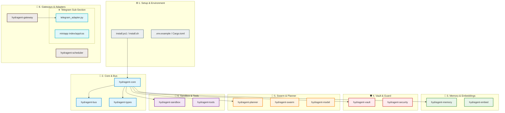

# 🐉 Hydragent Project Sections & Focus Areas

To help you focus and evolve **Hydragent** modularly, the codebase has been structured into **9 Logical Sections**. You can select any section below, dive into its specific crates/folders, run its tests, and work on its roadmap tasks independently.

---

## 🗺️ Workspace Map at a Glance



---

## ⚙️ Section 1: Installation, Setup & Build Environment
*Prerequisite builders, OS installers, workspace configurations, and local bootstrapping.*

* **Key Files:**
  * [`install.ps1`](file:///d:/Workspace/Hydragent/install.ps1): Windows PowerShell 5.1+ one-command installer.
  * [`install.sh`](file:///d:/Workspace/Hydragent/install.sh): macOS & Linux setup script.
  * [`Cargo.toml`](file:///d:/Workspace/Hydragent/Cargo.toml): Core Rust workspace configuration and dependencies.
  * [`Hydragent.cmd`](file:///d:/Workspace/Hydragent/Hydragent.cmd): Batch wrapper for commands (`install`, `onboard`, `chat`, `serve`).
  * [`.env.example`](file:///d:/Workspace/Hydragent/.env.example): Environment template with API keys, database paths, and log levels.
* **Onboarding & Verification Commands:**
  ```powershell
  # Local onboarding config
  .\Hydragent.cmd onboard
  
  # Build the entire cargo workspace
  cargo build --release
  ```

---

## 🧠 Section 2: Core Orchestration & Communication Bus
*The central brain, runtime CLI, and event infrastructure.*

* **Crates:**
  * [`hydragent-core`](file:///d:/Workspace/Hydragent/crates/hydragent-core): Core ReAct loop, CLI REPL, orchestrator, audit log.
  * [`hydragent-types`](file:///d:/Workspace/Hydragent/crates/hydragent-types): Shared event protocol types and data structures.
  * [`hydragent-bus`](file:///d:/Workspace/Hydragent/crates/hydragent-bus): TCP Event Bus implementation and wire protocol.
* **Key Entrypoints:**
  * [`crates/hydragent-core/src/main.rs`](file:///d:/Workspace/Hydragent/crates/hydragent-core/src/main.rs)
  * [`crates/hydragent-bus/src/lib.rs`](file:///d:/Workspace/Hydragent/crates/hydragent-bus/src/lib.rs)
* **Testing Command:**
  ```powershell
  cargo test -p hydragent-core
  cargo test -p hydragent-bus
  ```

---

## 💾 Section 3: Memory & Local Embeddings
*The memory palace, semantic vector databases, and indexing engines.*

* **Crates:**
  * [`hydragent-memory`](file:///d:/Workspace/Hydragent/crates/hydragent-memory): SQLite session store, BM25 + Vector hybrid retrieval.
  * [`hydragent-embed`](file:///d:/Workspace/Hydragent/crates/hydragent-embed): Embeddings generator utilizing local `all-MiniLM-L6-v2` via Candle.
* **Key Entrypoints:**
  * [`crates/hydragent-memory/src/lib.rs`](file:///d:/Workspace/Hydragent/crates/hydragent-memory/src/lib.rs)
  * [`crates/hydragent-embed/src/lib.rs`](file:///d:/Workspace/Hydragent/crates/hydragent-embed/src/lib.rs)
* **Testing Command:**
  ```powershell
  cargo test -p hydragent-memory
  cargo test -p hydragent-embed
  ```

---

## 🛡️ Section 4: Cryptographic Vault & Security Guard
*Argon2id credential protection, taint tracking, and prompt injection mitigation.*

* **Crates:**
  * [`hydragent-vault`](file:///d:/Workspace/Hydragent/crates/hydragent-vault): Encrypted secrets vault (Argon2id + XChaCha20-Poly1305 + mlock).
  * [`hydragent-security`](file:///d:/Workspace/Hydragent/crates/hydragent-security): Merkle audit logs, dynamic taint-checking, prompt injection guards.
* **Key Entrypoints:**
  * [`crates/hydragent-vault/src/lib.rs`](file:///d:/Workspace/Hydragent/crates/hydragent-vault/src/lib.rs)
  * [`crates/hydragent-security/src/lib.rs`](file:///d:/Workspace/Hydragent/crates/hydragent-security/src/lib.rs)
* **Testing Command:**
  ```powershell
  cargo test -p hydragent-vault
  cargo test -p hydragent-security
  ```

---

## 🐝 Section 5: Swarm, Planning & Model Council
*Multi-agent DAG planning, subagent spawning, and LLM orchestration.*

* **Crates:**
  * [`hydragent-planner`](file:///d:/Workspace/Hydragent/crates/hydragent-planner): DAG task decomposition & self-healing replanners.
  * [`hydragent-swarm`](file:///d:/Workspace/Hydragent/crates/hydragent-swarm): Subagent runners, orchestrators, and coordination logic.
  * [`hydragent-model`](file:///d:/Workspace/Hydragent/crates/hydragent-model): Model profiles (`config/model_council.yaml`) and token routing.
* **Key Entrypoints:**
  * [`crates/hydragent-planner/src/lib.rs`](file:///d:/Workspace/Hydragent/crates/hydragent-planner/src/lib.rs)
  * [`crates/hydragent-swarm/src/lib.rs`](file:///d:/Workspace/Hydragent/crates/hydragent-swarm/src/lib.rs)
  * [`crates/hydragent-model/src/lib.rs`](file:///d:/Workspace/Hydragent/crates/hydragent-model/src/lib.rs)
* **Testing Command:**
  ```powershell
  cargo test -p hydragent-planner
  cargo test -p hydragent-swarm
  ```

---

## 🧪 Section 6: Execution Sandbox & System Tools
*Safe, metered code runtimes (WASM & Docker) and host-level tool libraries.*

* **Crates:**
  * [`hydragent-sandbox`](file:///d:/Workspace/Hydragent/crates/hydragent-sandbox): Wasmtime instruction-metered script execution + Docker environments.
  * [`hydragent-tools`](file:///d:/Workspace/Hydragent/crates/hydragent-tools): Built-in system tools (search, filesystem, preferences).
* **Key Entrypoints:**
  * [`crates/hydragent-sandbox/src/lib.rs`](file:///d:/Workspace/Hydragent/crates/hydragent-sandbox/src/lib.rs)
  * [`crates/hydragent-tools/src/lib.rs`](file:///d:/Workspace/Hydragent/crates/hydragent-tools/src/lib.rs)
* **Testing Command:**
  ```powershell
  cargo test -p hydragent-sandbox
  cargo test -p hydragent-tools
  ```

---

## 🎓 Section 7: Self-Improving Skills Engine
*Auto-induction of skills, nighttime Dream compaction, and templates.*

* **Crates & Skills:**
  * [`hydragent-skills`](file:///d:/Workspace/Hydragent/crates/hydragent-skills): Skill library, Hermes extractor, 7-day curator, composer.
  * [`skills/builtin/`](file:///d:/Workspace/Hydragent/skills/builtin): YAML-based built-in skill configurations (summarization, translation, explanation, drafting).
* **Key Entrypoints:**
  * [`crates/hydragent-skills/src/lib.rs`](file:///d:/Workspace/Hydragent/crates/hydragent-skills/src/lib.rs)
* **Testing Command:**
  ```powershell
  cargo test -p hydragent-skills
  ```

---

## 🔌 Section 8: Gateways, Channel Adapters & Python SDK
*Bridges to external chat channels and developer APIs.*

* **Crates:**
  * [`hydragent-gateway`](file:///d:/Workspace/Hydragent/crates/hydragent-gateway): Multi-channel adapter hosting process.
  * [`hydragent-scheduler`](file:///d:/Workspace/Hydragent/crates/hydragent-scheduler): Cron/heartbeat engine for scheduled executions.
* **External Channels & Python SDK:**
  * [`adapters/channels/`](file:///d:/Workspace/Hydragent/adapters/channels): All adapters (Discord, Slack, CLI, Webhook, WebSocket, Web).
  * [`adapters/hydragent_py/`](file:///d:/Workspace/Hydragent/adapters/hydragent_py): Dynamic Python SDK for client integration.
* **Testing Command:**
  ```powershell
  cargo test -p hydragent-gateway
  cargo test -p hydragent-scheduler
  ```

### ✈️ Dedicated Sub-Section: Telegram Channel Adapter
*Real-time Telegram bot gateway and built-in Telegram Mini App web application.*

* **Key Files:**
  * [`adapters/channels/telegram/telegram_adapter.py`](file:///d:/Workspace/Hydragent/adapters/channels/telegram/telegram_adapter.py): Main bot event loop, command routers, and message receiver.
  * [`adapters/channels/telegram/miniapp/index.html`](file:///d:/Workspace/Hydragent/adapters/channels/telegram/miniapp/index.html): HTML front-end for the Telegram Mini App dashboard.
  * [`adapters/channels/telegram/miniapp/app.js`](file:///d:/Workspace/Hydragent/adapters/channels/telegram/miniapp/app.js): Interaction handlers, chart rendering, and event-bus integrations.
  * [`adapters/channels/telegram/miniapp/style.css`](file:///d:/Workspace/Hydragent/adapters/channels/telegram/miniapp/style.css): Custom CSS styles for native Telegram styling look & feel.
* **How to run / test:**
  ```powershell
  # Run the gateway with telegram configuration
  hydragent serve --channel telegram
  ```

---

## 🔬 Section 9: Benchmarks, Dev Tools & Diagnostics
*Evaluation frameworks, environment setup, and installation utilities.*

* **Crates & Tools:**
  * [`hydragent-bench`](file:///d:/Workspace/Hydragent/crates/hydragent-bench): SKILL-BENCH and Golden Set benchmarks.
* **Testing Command:**
  ```powershell
  cargo test -p hydragent-bench
  ```
