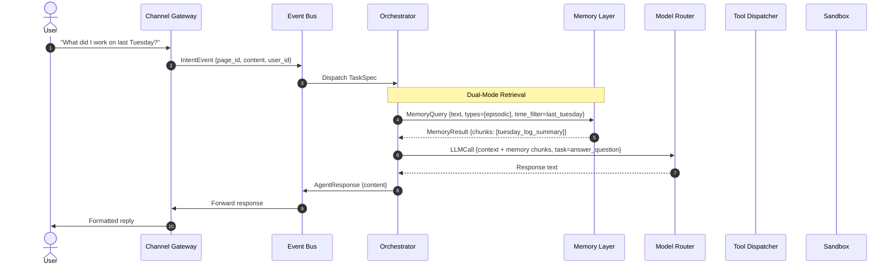
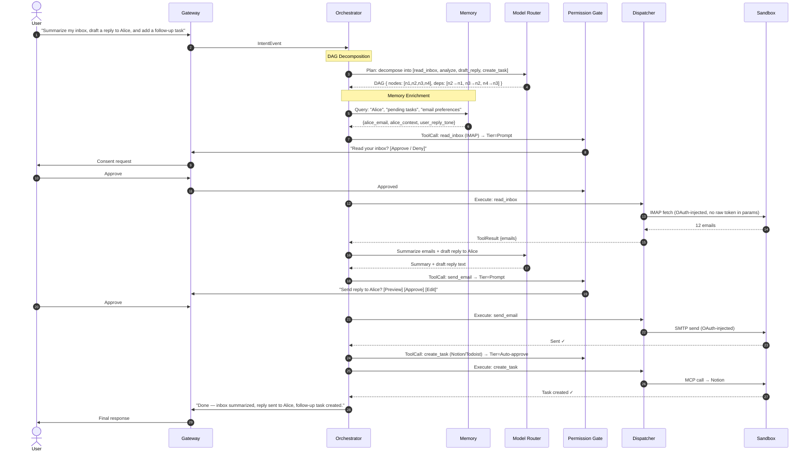
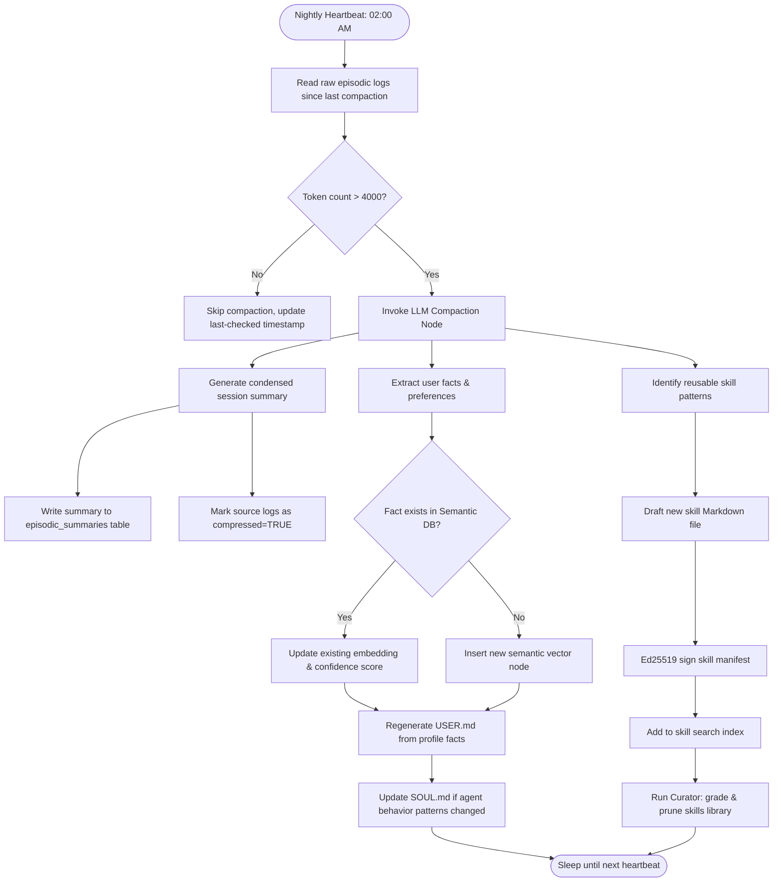

# Hydragent: Technical Architecture Specification

> Deep technical specification of the **Hydragent Unified AI Agent** — layers, interfaces, data schemas, execution flows, and security boundaries.

> **⚠️ This file is the *design* specification.** It describes the full target architecture across all 9 phases.
> Several items in this document (ChromaDB semantic store, Dreaming pipeline, Wasmtime/Docker sandboxes, WhatsApp/Signal/Matrix adapters, Model Council, 16-layer security, Merkle audit, etc.) are **planned but not yet present in the code**.
> For what is *really* implemented right now, see **[`STATE.md`](STATE.md)**.
> **Naming convention:** throughout this document the term **`session_id`** is used interchangeably with **`page_id`**. The Rust code currently calls the unit of memory `Page` and the field `page_id` (see `crates/hydragent-memory/src/lib.rs`); a future schema may rename the field back to `session_id`. The *shape* (parent, links, tags, embedding) is unchanged.

---

## Table of Contents

1. [Architectural Philosophy](#1-architectural-philosophy)
2. [Runtime Stack & Footprint](#2-runtime-stack--footprint)
3. [Layer-by-Layer Specification](#3-layer-by-layer-specification)
4. [End-to-End Execution Flow](#4-end-to-end-execution-flow)
5. [Memory Architecture & Dreaming Pipeline](#5-memory-architecture--dreaming-pipeline)
6. [Security Architecture & Cryptographic Boundaries](#6-security-architecture--cryptographic-boundaries)
7. [Subagent Swarm Topology](#7-subagent-swarm-topology)
8. [Model Council Routing Logic](#8-model-council-routing-logic)
9. [Data Schemas & Interface Contracts](#9-data-schemas--interface-contracts)
10. [Deployment Topologies](#10-deployment-topologies)

---

## 1. Architectural Philosophy

Hydragent synthesizes six architectural principles, each derived from a different tier of the 2026 AI agent landscape:

| Principle | Source | Technical Expression |
|---|---|---|
| **Separation of concerns** | LangGraph / CrewAI research | Each layer exposes a typed gRPC interface; no direct coupling between layers |
| **Zero-trust security** | IronClaw / OpenFang | Every inter-layer call carries a capability token; secrets are never passed as arguments |
| **Memory-as-filesystem** | memU | Memory is addressable, navigable, and human-readable — not opaque embeddings |
| **Ultra-low-footprint core** | NullClaw / ZeroClaw | Core runtime compiles to a single static binary < 1 MB RAM |
| **Pluggable components** | OpenClaw / ZeroClaw | Models, channels, tools, and memory backends swap without recompilation via vtable interfaces |
| **Human primacy** | Microsoft Scout / Devin | No state-mutating action executes without passing through a permission gate |

### 1.1 Conceptual Mapping (Library Analogy)

Hydragent operates based on the Library Analogy conceptual architecture (informed by the Hermes Self-Improving Agent model):

| Library Concept | Self-Improving Representation | Implementation Layer |
|---|---|---|
| **The Desk** | Active execution workspace (commands, skills, search, tool calls) | `react_loop.rs` |
| **Draft Paper** | Ephemeral context of the ongoing conversation | In-memory message list (committed only after the session ends) |
| **Page** | Condensed knowledgeable insights + User's personality/habit traits extracted from the session | `nodes` table (type = `"page"`) + `USER.md`/`SOUL.md` |
| **Book** | Topic clusters compiling related pages (e.g. "Aerospace", "AI", "Rust") | `nodes` table (type = `"book"`) |
| **Shelf** | Domain categorization clusters (e.g. "User's Area of Interest", "Way of Thinking") | `nodes` table (type = `"shelf"`) |
| **Web Connections** | Dynamic relationships mapping books to shelves, pages to books, and cross-references | `edges` table (generated/updated via `graphify`) |
| **Librarian** | The Hydragent core, performing actions, dreaming, and managing the library | `dream.rs` / `main.rs` |

### 1.2 Ingestion Loop & Hybrid Query Bridge

To minimize LLM extraction costs, Hydragent implements a hybrid ingestion and search pipeline:
- **75% Graphify / 25% LLM Ingestion**: Summarization and personality habit extraction (updating `USER.md` and `SOUL.md` under character caps) are computed by the LLM (25% weight). The remaining graph nodes (Pages, Books, Shelves), local file AST dependencies, and community organizing (Louvain clustering) are run locally by `graphify` (75% weight) without LLM overhead.
- **Unified Hybrid Query Bridge**: Located in `retrieval.rs`, this runs keyword indexes (SQLite FTS5) and local Graphify AST/network traversal in parallel using async tokio joins (`< 10ms`) to compile context without redundant LLM searches.

---

## 2. Runtime Stack & Footprint

### 2.1 Core Runtime: Rust + Zig + Python Hybrid

Hydragent uses a **language-per-concern** strategy agreed by the engineering team:

| Layer | Language | Rationale |
|---|---|---|
| Core orchestrator, event bus, tool dispatcher, security vault | **Rust** | Memory safety, Tokio async, auditable `unsafe`, WASM targets, strong crate ecosystem |
| Edge binary (RISC-V / ESP32-S3, optional) | **Zig** | ≤ 678 KB static binary, < 2 ms cold start, first-class cross-compile without extra toolchain |
| Channel adapters, RAG pipelines, ML glue, eval harness | **Python** | Rich ML/LLM libraries, fast prototyping; never used in security-critical or latency-critical paths |

**Binary targets** (Rust core):

```
hydragent            ~15 MB   (full: cloud API + local Ollama, Rust release build)
hydragent-server     ~5 MB    (headless server, no browser sandbox, Rust release build)
hydragent-edge       ~678 KB  (Zig, RISC-V / ESP32-S3, local inference only, < 1 MB RAM)
hydragent-mcu        ~150 KB  (Zig, ESP32-S3 bare-metal, on-device TinyLlama)

Rust core runtime footprint:
  RAM (server):     < 30 MB
  RAM (full):       < 100 MB
  Startup latency:  < 50 ms (Rust binary, cold start)

Zig edge footprint:
  RAM (edge):       < 1 MB
  Startup latency:  < 2 ms (Zig binary, cold start)
```

### 2.2 Technology Stack by Layer

| Layer | Language | Key Dependencies |
|---|---|---|
| Core Orchestrator | **Rust** (tokio async) | `tokio`, `anyhow`, `tracing`, `clap` |
| Event Bus | **Rust** | `tokio::net::TcpListener`, `serde_json` |
| Channel Gateway (adapters) | **Python** | `asyncio`, `python-telegram-bot`, `discord.py`, `rich` |
| Memory Engine | **Rust** + SQLite | `sqlx` (WAL mode), `serde` |
| Vector Store | **Python** bridge | `chromadb`, `faiss`, `sentence-transformers` |
| Tool Dispatcher | **Rust** | `reqwest`, `tokio`, TCP socket IPC |
| Browser Bot | **Python** | `playwright`, async subprocess |
| Code Sandbox | Docker Engine API | Daytona/E2B-compatible; managed from Rust via `bollard` |
| Security Vault | **Rust** + `libsodium` | `sodiumoxide` (XChaCha20, Argon2id) |
| WASM Runtime | **Rust** + Wasmtime | `wasmtime` crate (first-class Rust bindings) |
| gRPC Event Bus (Phase 2+) | **Rust** | `tonic`, `prost` (protobuf) |
| Edge Binary | **Zig** | Zig stdlib, llama.cpp C API, musl libc |

### 2.3 System Architecture Diagram

```
┌─────────────────────────────────────────────────────────────────────────────┐
│                        HYDRAGENT RUNTIME STACK                              │
│                                                                             │
│  ┌─────────────────────────────────────────────────────────────────────┐   │
│  │  LAYER 1: CHANNEL GATEWAY                                           │   │
│  │  [Telegram] [Discord] [WhatsApp] [Slack] [Signal] [iMessage]       │   │
│  │  [Matrix]   [Email]   [Voice]    [CLI]   [Web]    [MQTT/IoT]       │   │
│  │  [DingTalk] [QQ]      [WeChat]   [Teams] [Lark]   [Webhooks]       │   │
│  └──────────────────────────────────┬────────────────────────────────┘   │
│                                     │  IntentEvent (JSON-RPC over HTTP/2)  │
│  ┌──────────────────────────────────▼────────────────────────────────┐   │
│  │  LAYER 2: EVENT BUS & API ROUTER (gRPC / HTTP2)                   │   │
│  │  • Message dedup & ordering    • Rate limiting & backpressure      │   │
│  │  • Session correlation         • Priority queuing                  │   │
│  └──────────────────────────────────┬────────────────────────────────┘   │
│                                     │  Dispatched TaskSpec                 │
│  ┌──────────────────────────────────▼────────────────────────────────┐   │
│  │  LAYER 3: CORE ORCHESTRATOR (DAG Planner + ReAct Loop)            │   │
│  │  • DAG task decomposition       • ReAct step-by-step reasoning     │   │
│  │  • Self-healing re-planner      • Subagent spawner                 │   │
│  │  • Model Council selector       • Consent gate enforcer            │   │
│  └─────────┬─────────────────┬─────────────────┬─────────────────────┘   │
│             │                 │                 │                          │
│  ┌──────────▼──────┐  ┌───────▼──────┐  ┌──────▼──────────────────────┐ ┌──────────────────────┐  │
│  │  LAYER 4:       │  │  LAYER 5:    │  │  LAYER 5b: SKILL ENGINE      │ │  LAYER 5c: BENCHMARK   │  │
│  │  MEMORY LAYER   │  │  MODEL       │  │  • Skill library (SQLite+    │ │  • SKILL-BENCH 80 tasks │  │
│  │                 │  │  ROUTER      │  │    FTS5)                     │ │  • Golden Set 30 pairs  │  │
│  │  • Episodic     │  │              │  │  • 7-day Curator cycle       │ │  • R@k / MRR / F1       │  │
│  │    (SQLite)     │  │  • OpenRouter│  │  • Hermes-style induction    │ │  • JSON BenchReport     │  │
│  │  • Semantic     │  │  • Ollama    │  │  • Skill Executor + Composer │ │  • 5 integration tests  │  │
│  │  • Procedural   │  │  • 20+ model │  │  • 5 LLM-callable tools      │ │  • CLI: bin/bench       │  │
│  │    (Skills)     │  │    pool      │  └─────────────────────────────┘ └────────────────────────┘  │
│  │  • Emotional    │  │  • Cost +    │                                    │                              │
│  │    (SQLite)     │  │    latency   │                                    │                              │
│  │                 │  │    routing   │                                    │                              │
│  └──────────┬──────┘  └──────────────┘                                    │
│             │                                                              │
│  ┌──────────▼──────────────────────────────────────────────────────────┐  │
│  │  LAYER 6: TOOL DISPATCHER & SECURITY VAULT                         │  │
│  │  • 3-tier permission gate        • XChaCha20-Poly1305 vault        │  │
│  │  • Boundary key injection        • Ed25519 skill verification      │  │
│  │  • Egress domain allowlist       • Secret zeroization              │  │
│  │  • Merkle audit logging          • Taint tracking                  │  │
│  └──────────┬──────────────────────────────────────────────────────────┘  │
│             │  Scoped capability tokens                                    │
│  ┌──────────▼──────────────────────────────────────────────────────────┐  │
│  │  LAYER 7: EXECUTION SANDBOX                                        │  │
│  │  ┌──────────────┐  ┌──────────────┐  ┌────────────────────────┐   │  │
│  │  │ WASM Runtime │  │ Docker Conts │  │  MCP Tool Servers      │   │  │
│  │  │ (Wasmtime)   │  │ (Browser +   │  │  (Notion, Linear,      │   │  │
│  │  │ Zero net/fs  │  │  Code Exec)  │  │   Postgres, Stripe...) │   │  │
│  │  └──────────────┘  └──────────────┘  └────────────────────────┘   │  │
│  └─────────────────────────────────────────────────────────────────────┘  │
└─────────────────────────────────────────────────────────────────────────────┘
```

---

## 3. Layer-by-Layer Specification

### Layer 1: Channel Gateway

**Responsibility**: Normalize all inbound user messages into internal `IntentEvent` schema; format all outbound responses into channel-appropriate format.

**Internal Interface (gRPC)**:
```protobuf
service GatewayService {
  rpc SendIntent(IntentEvent) returns (stream AgentResponse);
  rpc RegisterChannel(ChannelConfig) returns (RegistrationResult);
  rpc GetChannelStatus(ChannelId) returns (ChannelStatus);
}

message IntentEvent {
  string page_id    = 1;
  string channel_id = 2;
  string user_id    = 3;
  string content    = 4;
  repeated Attachment attachments = 5;
  map<string, string> metadata = 6;
  int64 timestamp = 7;
}
```

**Adapter Architecture**: Each channel adapter is a lightweight plugin conforming to the `ChannelAdapter` vtable interface. Adding a new channel (e.g., a new messaging platform) requires implementing 3 methods:
- `on_message(raw_msg) → IntentEvent`
- `send_response(AgentResponse) → void`
- `get_config() → ChannelConfig`

### Layer 2: Event Bus & API Router

**Responsibility**: Reliable message delivery between gateway and orchestrator. Handles ordering, deduplication, backpressure, and session correlation.

**Implementation**: A Rust (Tokio async) HTTP/2 multiplexer with:
- In-order message delivery per `session_id`
- At-least-once delivery guarantees with idempotency keys
- Priority queuing: `URGENT > NORMAL > BACKGROUND`
- Backpressure signaling to gateway when orchestrator queue depth > 100 items

### Layer 3: Core Orchestrator

**Responsibility**: The reasoning kernel. Takes an `IntentEvent`, queries memory, constructs a DAG execution plan via the Model Router, and coordinates tool execution through the Tool Dispatcher.

**Core Loop (ReAct pattern)**:
```
WHILE task not complete AND step_count < MAX_STEPS:
  1. THINK: Query memory, build context window, call Model Router for next action
  2. ACT:   Issue action to Tool Dispatcher (with permission gate check)
  3. OBSERVE: Receive tool output, update session state
  4. EVALUATE: Check if goal is reached OR if re-planning is needed
  
IF error detected:
  → Self-healing re-planner: inject error trace, generate new branch
  → If 3+ failures: escalate to human-in-loop consent gate
```

**DAG Planner**:
- Complex tasks are decomposed into a Directed Acyclic Graph of subtasks
- Each node in the DAG: `{ task_id, description, deps[], assigned_agent_role, model_preference, tool_set }`
- DAG is serialized to JSON and stored in session state; allows resumption after interruption
- Topological sort determines execution order; independent nodes execute in parallel
- **Swarm ceiling**: Up to 300 concurrent sub-agents, 4,000 coordinated steps per project *(Kimi K2.6 capacity target)*
- **Plan Mode**: DAG is presented to the user for review before any Build-Mode execution begins; no file writes or tool calls in Plan Mode

### Layer 4: Memory Layer

See [Memory Architecture section](#5-memory-architecture--dreaming-pipeline) for full specification.

**Key interfaces**:
```
MemoryQuery {
  query_text: string
  memory_types: [episodic, semantic, procedural, emotional]
  top_k: int (default: 10)
  min_score: float (default: 0.6)
  time_filter: DateRange (optional)
}

MemoryResult {
  chunks: [{ content: string, source: MemoryType, score: float, timestamp: int }]
  total_tokens: int
}
```

### Layer 5: Model Router

**Responsibility**: Route each LLM call to the optimal model based on task type, cost budget, latency requirement, and model availability.

**Routing algorithm**:
```
1. Classify task type (code / research / writing / reasoning / embedding / vision)
2. Check cost_budget constraint from task metadata
3. Check latency_requirement constraint
4. Filter model pool to available models meeting constraints
5. Score remaining models: w1*quality + w2*(1/cost) + w3*(1/latency)
6. Select top-scored model; if unavailable → next in fallback chain
7. Execute call with retry (3 attempts, exponential backoff)
```

### Layer 5b: Skill Engine

**Responsibility**: Persist, induce, execute, and curate reusable skills. A "skill" is a named
prompt template with typed parameters, an optional tool allowlist, and a `{{param}}`-style
Mustache body that the orchestrator can replay deterministically.

**Crate**: `hydragent-skills` ([`crates/hydragent-skills/`](crates/hydragent-skills)).

**Storage** — `SkillLibrary` (SQLite + FTS5, see [`migrations/005_skill_library.sql`](migrations/005_skill_library.sql)):

| Table              | Purpose                                                    |
|--------------------|------------------------------------------------------------|
| `skills`           | Current head of each skill (`id`, `tier`, `tier_updated`)  |
| `skill_versions`   | Append-only history; every `update_skill` writes a row     |
| `skill_tags`       | Normalised tag table, JOIN'd into FTS5 for `search_by_tag` |
| `skill_executions` | `SkillExecutionRecord` rows for the 7-day curator          |
| `skills_fts`       | FTS5 virtual table on `name ‖ description`, 4 sync triggers |

**Components** ([`crates/hydragent-skills/src/`](crates/hydragent-skills/src)):

- `skill.rs` — `Skill`, `SkillSpec`, `SkillParam`, `render_template`
- `library.rs` — `SkillLibrary::open`, `insert_skill`, `get_skill`, `list_skills`, `search_by_tag`, FTS5
- `extractor.rs` — Hermes-style `SkillExtractor` (deterministic, no LLM in MVP) + Jaccard dedup
- `executor.rs` — `SkillExecutor::execute` with required-param validation + tool-allowlist
- `curator.rs` — `SevenDayCurator` (`0 3 * * 0` cron, 7-day rolling window, tier transitions)
- `composer.rs` — `SkillComposer` merges ≥ 2 compatible skills and resolves `{{param}}` conflicts
- `tools.rs` — 5 LLM-callable tools (`skill_list`, `skill_search`, `skill_execute`, `skill_curator_run`, `skill_induce`)

**Dreaming integration** ([`crates/hydragent-core/src/skill_induction.rs`](crates/hydragent-core/src/skill_induction.rs)):

```
run_dream_cycle:
  1. consolidate recent messages
  2. filter to successful ReAct trajectories
  3. extract SkillCandidate via SkillExtractor (Hermes)
  4. dedup by Jaccard over capability_tags
  5. insert at SkillTier::Candidate
  → next Sunday's curator will either promote or archive
```

**Tests** (52 total in `hydragent-skills`):
- 11 unit tests in `library.rs` (CRUD, FTS5, tag search)
- 17 unit tests in `skill.rs` (YAML round-trip, `render_template` with 0/1/N params)
- 6 unit tests in `extractor.rs` (Hermes dedup edge cases)
- 4 unit tests in `executor.rs` (missing-param, allowlist, success record)
- 4 unit tests in `curator.rs` (boundary success_rate, total thresholds)
- 4 unit tests in `composer.rs` (merge two-skill, conflict resolution)
- 4 integration tests (`tests/builtin_loading_test.rs`)
- + 4 in `hydragent-core/src/skill_induction.rs`

**Built-in skills** ([`skills/builtin/`](skills/builtin)):
- `convert-csv-to-json.yaml` (tier: active, tags: data,csv,json,transform)
- `summarize-github-issue.yaml` (tier: active, tags: github,text,summary)
- `debug-rust-error.yaml` (tier: active, tags: rust,error,debug)

**Benchmark**: `hydragent-bench` crate (see [§Layer 5c: Benchmarking](#layer-5c-benchmarking) below)

### Layer 5c: Benchmarking

**Responsibility**: Track retrieval and agent capability over time. Phase 7 introduces two
retrieval-oriented benchmarks: **SKILL-BENCH** (80 paraphrased queries × known-relevant
skill ids) and the **Golden Set** (30 hand-verified multi-relevance pairs). Future
phases will add full agent runs (ReAct + tool-use) and human-judge pairs.

**Crate**: `hydragent-bench` ([`crates/hydragent-bench/`](crates/hydragent-bench)).

**Modules** ([`crates/hydragent-bench/src/`](crates/hydragent-bench/src)):

- `dataset.rs` — `SkillBenchTask`, `GoldenSetItem` JSONL loaders
- `metrics.rs` — `recall_at_k`, `reciprocal_rank`, `Prf` (precision/recall/F1)
- `runner.rs` — `SkillBenchRunner` + `GoldenSetRunner` with pluggable `Retriever = Box<dyn Fn(&str) -> Vec<String> + Send + Sync>`
- `report.rs` — `BenchReport` JSON serialiser + ASCII summary

**Data** ([`tests/bench/`](tests/bench)):

| File | Lines | Purpose |
|------|------:|---------|
| `skill_bench_v1.jsonl` | 80 | 10 skills × 8 paraphrases; each row = `{query, relevant_skill_id}` |
| `golden_set_v1.jsonl` | 30 | 10 single / 15 dual / 5 triple relevance; multi-relevant pairs test precision vs recall |

**CLI** ([`crates/hydragent-bench/bin/bench.rs`](crates/hydragent-bench/bin/bench.rs)):

```bash
cargo run -p hydragent-bench --bin bench -- \
    --skill-bench tests/bench/skill_bench_v1.jsonl \
    --golden-set  tests/bench/golden_set_v1.jsonl \
    --output      reports/bench-v0.7.0.json
```

Output: a `BenchReport` JSON with `version`, `generated_at`, `skill_bench` (R@1/3/5, MRR),
and `golden_set` (precision, recall, F1).

**Tests** (30 total):
- 25 unit tests across all 4 modules
- 5 integration tests using the real `SkillLibrary` + real bench data (the `Retriever`
  closure calls `lib.search_by_keyword`)

**LoRA fine-tuning** ([`tools/finetune/`](tools/finetune)):
- `generate_dataset.py` — extracts successful ReAct turns → JSONL training data
- `train_lora.py` — 4-bit `peft` + `bitsandbytes` LoRA trainer (Gemma 2 2B default)
- `evaluate_model.py` — runs the fine-tuned model against SKILL-BENCH + Golden Set
- Taint-checked: zero `Secret`-classified data leaks into training sets

### Layer 6: Tool Dispatcher & Security Vault

**Responsibility**: Execute tool calls with security enforcement — permission gating, key injection, egress filtering, audit logging.

**Tool invocation flow**:
```
Orchestrator → Dispatcher: ToolCall { tool_id, params, capability_token }
                            ↓
[1] Verify capability_token has permission for this tool
                            ↓
[2] Classify action tier (Auto-approve / Prompt / Deny)
                            ↓
[3] If Prompt: Send consent request to Gateway → User → await approval
                            ↓
[4] Inject secrets: replace {{PLACEHOLDER}} with vault-decrypted value
                            ↓
[5] Execute tool in appropriate sandbox (WASM / Docker / Host-restricted)
                            ↓
[6] Capture result; zeroize injected secrets from call params
                            ↓
[7] Append action record to Merkle audit log
                            ↓
Dispatcher → Orchestrator: ToolResult { output, status, execution_ms }
```

### Layer 7: Execution Sandbox

**Three sandbox tiers**:

**WASM Sandbox** (Wasmtime):
- Zero host filesystem access (unless explicitly scoped to `/workspace/`)
- Zero socket creation (network calls go through host proxy with allowlist)
- CPU instruction limit: 10 billion instructions max
- Memory limit: 64 MB
- Used for: custom tool scripts, data formatters, calculators, text processors

**Docker Container Sandbox**:
- Per-session isolated container with ephemeral filesystem
- Resource limits: 2 CPU cores, 512 MB RAM, 120s timeout
- Network: allowlist-gated via iptables rules
- Used for: code execution, browser automation (Playwright), build systems

**MCP Server Connection**:
- Connects to external MCP-compatible servers via Unix socket or HTTP
- Each MCP server has its own capability scope (e.g., Notion MCP can only access Notion)
- Used for: third-party integrations (Notion, Linear, Postgres, Stripe, GitHub, etc.)

---

## 4. End-to-End Execution Flow

### 4.1 Simple Query Flow



### 4.2 Complex Multi-Step Task Flow



---

## 5. Memory Architecture & Dreaming Pipeline

### 5.1 Storage Schema

**Episodic Memory (SQLite — WAL mode)**:
```sql
CREATE TABLE episodic_logs (
  id          INTEGER PRIMARY KEY,
  page_id     TEXT NOT NULL,
  timestamp   INTEGER NOT NULL,
  role        TEXT CHECK(role IN ('user','agent','system')),
  content     TEXT NOT NULL,
  token_count INTEGER,
  compressed  BOOLEAN DEFAULT FALSE,
  summary_ref TEXT  -- FK to episodic_summaries if compressed
);

CREATE TABLE episodic_summaries (
  id          INTEGER PRIMARY KEY,
  date        TEXT NOT NULL,  -- YYYY-MM-DD
  summary     TEXT NOT NULL,
  token_count INTEGER,
  source_ids  TEXT  -- JSON array of episodic_log ids
);
```

**Semantic Memory (ChromaDB + BM25 dual-index)**:
```
Collection: hydragent_semantic
  Document fields:
    - content: string (the fact / knowledge chunk)
    - source:  string (episodic log id, document path, or URL)
    - category: string (user_fact, world_knowledge, skill_knowledge)
    - timestamp: int
    - confidence: float (0.0–1.0)
  
  Retrieval:
    - Vector: cosine similarity via nomic-embed-text embeddings
    - Keyword: BM25 over content field
    - Fusion: Reciprocal Rank Fusion (k=60)
```

**Emotional / Profile Memory (SQLite)**:
```sql
CREATE TABLE user_profile (
  key         TEXT PRIMARY KEY,
  value       TEXT NOT NULL,
  confidence  REAL DEFAULT 1.0,
  source      TEXT,
  updated_at  INTEGER
);

CREATE TABLE sentiment_log (
  id          INTEGER PRIMARY KEY,
  page_id     TEXT,
  timestamp   INTEGER,
  sentiment   TEXT CHECK(sentiment IN ('positive','neutral','negative')),
  intensity   REAL,
  trigger     TEXT
);
```

### 5.2 Dreaming Pipeline (Nightly Memory Consolidation)



### 5.3 Context Window Management *(from Claude Code)*

For long sessions, Hydragent uses a multi-strategy context management system:

| Situation | Strategy |
|---|---|
| Session token count < 50% of model's limit | Pass full conversation history |
| Session token count 50–80% of limit | Apply ReMe compaction: summarize older turns |
| Session token count > 80% of limit | Truncate to retention window + inject episodic summary |
| Spawning a subagent | Fresh context window; inject relevant memory chunks only |
| Background task (cron) | No conversation history; inject USER.md + task context only |

### 5.4 Bounded Markdown Hot Memory (Hermes Pattern)

Hydragent implements the **Hermes "bounded hot memory"** pattern to solve the core problem of passive storage bloat. Unbounded vector stores accumulate raw information without judgment, creating a noisy environment that degrades retrieval quality. 

Instead of passive accumulation, Hydragent's declarative hot memories live in two plain Markdown files under strict character ceilings. This budget forces the agent to periodically rewrite, consolidate, and curate its hot memory.

#### 5.4.1 Files and Limits

| File | Character Ceiling | Purpose | Approximate Token Budget |
| :--- | :--- | :--- | :--- |
| `config/USER.md` | `USER_MD_CHAR_LIMIT` = `6,000` | Episodic user memory (preferences, habits, interaction style). | ~1,500 tokens |
| `config/SOUL.md` | `SOUL_MD_CHAR_LIMIT` = `12,000` | World/Agent memory (rules of engagement, core identity, project boundaries). | ~3,000 tokens |

#### 5.4.2 Compaction & Re-Synthesis Flow

When a file exceeds its character limit, the system does not mechanically truncate. It uses **LLM-driven re-synthesis** (the Hermes true approach):

1. **Dream Cycle Startup Check**: On startup, the dream cycle runs `startup_compaction_check`. If either file is over limit (e.g. from raw manual edits or legacy appends), it triggers an immediate LLM compaction.
2. **Post-Append Compaction**: During the dream cycle, when new facts are appended (via `BoundedMd::append_curated`), if the file exceeds its character budget, `compact_md_with_llm` is invoked.
3. **LLM Prompting & Validation**:
   - The over-limit content is sent to the LLM with `crates/hydragent-core/src/prompts/compaction_prompt.txt`.
   - The LLM consolidates near-duplicates, groups related items, ranks entries by importance, and formats the output to fit strictly under the character limit.
   - The output is validated: if it is still over the limit, it is rejected to prevent partial file corruption or unbounded creep.
4. **Client Write Warnings**: When external RPC clients write to configuration files via `ConfigWriteHandler`, the orchestrator checks limits and logs a warning if a write exceeds the budget. Compaction will automatically run during the next dream cycle.

---

## 6. Security Architecture & Cryptographic Boundaries

### 6.1 Threat Model

| Threat | Vector | Mitigation Layer |
|---|---|---|
| Prompt injection | Malicious user input tricks agent into revealing secrets | L5: Taint tracking on user input fields |
| Credential exfiltration | Agent leaks API keys in responses | L3: Boundary key injection; L8: Secret zeroization |
| Code execution escape | Malicious code exits sandbox | L6: WASM capability restrictions; Docker namespacing |
| Memory poisoning | Attacker injects false facts into memory | L4: Ed25519-signed skill files; confidence scoring |
| Supply chain attack | Malicious community skill imported | L11: Pre-load security scanning; sandbox all marketplace skills |
| Replay attacks | Intercepted API calls replayed | L14: Nonce-signed request tokens; timestamp validation |
| Unauthorized tool access | Agent accesses tools beyond its permission scope | L13: Capability token verification per tool call |
| Data exfiltration via logs | Audit logs contain sensitive PII | L16: Differential privacy; credential redaction in logs |

### 6.2 Vault Implementation

```
Vault file: .hydravault

Upgraded V2 Vault Structure:
The vault file is serialized via bincode as `VaultMetadataV2` containing two decryption slots (similar to LUKS):
- Slot 0 (Passphrase PIN): Unlocks the master key using the user-memorable PIN.
- Slot 1 (Admin Key File): Unlocks the master key using a local physical cryptographic private key file (e.g. Ed25519).

Metadata (Serialized V2 Format):
{
  "magic": [72, 86, 76, 84], // "HVLT"
  "version": 2,
  "master_key_nonce": [u8; 24],
  "slot_0": {
    "active": bool,
    "salt": [u8; 32],
    "nonce": [u8; 24],
    "encrypted_master_key": Vec<u8>
  },
  "slot_1": {
    "active": bool,
    "salt": [u8; 32],
    "nonce": [u8; 24],
    "encrypted_master_key": Vec<u8>
  },
  "encrypted_payload": Vec<u8> // HashMap<String, String> of secrets encrypted by master_key
}

Encryption:
  Master Key KDF: Argon2id (memory=65536 KB, iterations=3, parallelism=4)
  Passphrase:     Passphrase PIN (Slot 0) or Admin Key File bytes (Slot 1)
  Cipher:         XChaCha20-Poly1305 (96-bit nonce, 256-bit key)

Remote Administrative Auth:
  To bypass LLM vision/context completely and support out-of-band updates,
  vault commands execute over JSON-RPC (port 5000) using a challenge-response protocol:
  1. Server stores PBKDF2-HMAC-SHA256(Passphrase PIN, Salt) in `config/security/admin_auth.hash`.
  2. Remote client requests a challenge nonce.
  3. Client signs the challenge via signature = HMAC_SHA256(PBKDF2_derived_key, challenge).
  4. Server verifies signature using the stored PBKDF2 hash, enabling authorized vault writes.
```

### 6.3 Merkle Audit Log

```
Each action appended to the audit log creates a new Merkle leaf:

Leaf data:
  {
    "action_id":    "uuid-v4",
    "timestamp":    1749216000,
    "tool_id":      "send_email",
    "params_hash":  "sha256(redacted_params)",  // credentials already removed
    "user_id":      "user-abc",
    "page_id":      "sess-xyz",
    "outcome":      "success",
    "approved_by":  "user|auto"
  }

Merkle root updated after each leaf insertion.
Root hash published to SOUL.md on each Dreaming cycle.
Audit log is append-only; any tampering detected by root hash mismatch.
```

---

## 7. Subagent Swarm Topology

### 7.1 Spawn & Communication Protocol

When the Core Orchestrator determines a task requires multi-agent parallelism:

```
1. Orchestrator creates a SwarmSession with:
   - shared_context: relevant memory chunks + task description
   - dag_spec: the full DAG JSON
   - role_assignments: { node_id → agent_role }

2. For each parallel DAG branch:
   - Orchestrator spawns a child agent process
   - Child receives: { system_prompt, tool_set, context_window, parent_session_id }
   - Child communicates results back via gRPC stream to parent

3. Parent orchestrator:
   - Merges results as nodes complete
   - Detects dead/zombie workers (missed heartbeat × 3)
   - Re-assigns zombie tasks to new workers
   - Synthesizes final result from all completed branches
```

### 7.2 Agent Role Definitions

```yaml
# config/agents/plan_agent.yaml
role: plan
system_prompt: |
  You are a read-only planning agent. Your job is to analyze the codebase,
  understand the task, and produce a clear execution plan as a JSON DAG.
  You MUST NOT modify any files. You MUST NOT execute any code.
  Only use: file_read, memory_query, web_search.
tools: [file_read, memory_query, web_search]
max_context_tokens: 200000
max_steps: 20

# config/agents/build_agent.yaml
role: build
system_prompt: |
  You are a build agent. Implement the steps assigned to you in the execution plan.
  Write clean, well-commented code. Run tests after implementing changes.
  If you encounter an error, capture the full trace and report it to the orchestrator.
tools: [file_io, code_exec, git, memory_query]
max_context_tokens: 100000
max_steps: 50

# config/agents/scout_agent.yaml
role: scout
system_prompt: |
  You are a documentation research agent. Your job is to find accurate, up-to-date
  technical information from official documentation, GitHub repos, and trusted sources.
  Summarize findings concisely with source attribution.
tools: [web_search, browser_bot, http_request]
max_context_tokens: 100000
max_steps: 30
```

### 7.3 Hermes Kanban Board State Machine

```
Task States:
  QUEUED → CLAIMED → IN_PROGRESS → REVIEW → DONE
                  ↘             ↗
                    FAILED → RETRY (max 5) → ESCALATED

Heartbeat protocol:
  Worker sends heartbeat every 30 seconds.
  Parent marks worker as ZOMBIE if 3 consecutive heartbeats missed.
  ZOMBIE tasks released back to QUEUED state for re-assignment.

Hallucination recovery:
  Before marking a task DONE, output is validated:
    1. If task type=code: run tests; DONE only if tests pass
    2. If task type=research: cross-reference at least 2 sources
    3. If task type=writing: self-critique pass for factual claims
```

---

## 8. Model Council Routing Logic

### 8.1 Task Classification → Model Mapping

```python
# Simplified routing logic (actual implementation in Zig)

ROUTING_TABLE = {
    "code_generation":    ["claude-sonnet-4", "gpt-4o", "deepseek-coder-v2:local"],
    "code_review":        ["claude-sonnet-4", "gpt-4o"],
    "web_research":       ["gemini-flash", "perplexity-sonar"],
    "long_form_writing":  ["claude-sonnet-4", "gpt-4o"],
    "fast_summary":       ["gpt-4o-mini", "gemini-flash", "mistral-7b:local"],
    "embedding":          ["nomic-embed-text:local", "text-embedding-3-small"],
    "image_analysis":     ["claude-sonnet-4-vision", "gpt-4o-vision"],
    "image_generation":   ["dall-e-3", "flux-dev", "stable-diffusion:local"],
    "orchestration":      ["claude-opus-4", "gpt-4o", "qwen-72b:local"],
    "edge_inference":     ["tinyllama-1b:local", "phi-3-mini:local"],
}

def route(task_type, budget_usd=None, max_latency_ms=None):
    candidates = ROUTING_TABLE[task_type]
    filtered = filter_by_budget(candidates, budget_usd)
    filtered = filter_by_latency(filtered, max_latency_ms)
    return rank_by_score(filtered)  # quality * (1/cost) * (1/latency)
```

### 8.2 OpenRouter-Compatible API Interface

All model calls use the OpenRouter-compatible API, enabling seamless swapping:

```
POST /v1/chat/completions

Headers:
  Authorization: Bearer {{OPENROUTER_API_KEY}}  ← injected by vault at network boundary
  X-Hydragent-Session: {session_id}
  X-Hydragent-Budget: {budget_usd}

Body:
  {
    "model": "anthropic/claude-sonnet-4",
    "messages": [...],
    "tools": [...],
    "max_tokens": 4096,
    "stream": true
  }
```

Local Ollama calls use the same interface format with `"model": "ollama/{model_name}"`.

---

## 9. Data Schemas & Interface Contracts

### 9.1 Core Event Schema

```typescript
// IntentEvent — inbound from gateway
interface IntentEvent {
  page_id:      string;          // UUID v4
  channel_id:   string;          // e.g., "telegram:123456"
  user_id:      string;
  content:      string;          // User's message text
  attachments:  Attachment[];    // Files, images, voice clips
  metadata:     Record<string, string>;
  timestamp:    number;          // Unix epoch ms
  priority:     "urgent" | "normal" | "background";
}

// AgentResponse — outbound to gateway
interface AgentResponse {
  page_id:      string;
  content:      string;
  format:       "markdown" | "plain" | "html";
  actions:      ConsentRequest[];  // Any pending approval requests
  tool_calls:   ToolCall[];        // Executed tool calls (for log display)
  metadata:     Record<string, string>;
}

// ToolCall — internal
interface ToolCall {
  call_id:      string;
  tool_id:      string;          // e.g., "send_email", "code_exec"
  params:       Record<string, unknown>;  // No raw secrets; placeholders used
  capability:   CapabilityToken;
  tier:         "auto" | "prompt" | "deny";
  status:       "pending" | "approved" | "denied" | "complete" | "failed";
  result?:      unknown;
  execution_ms: number;
}
```

### 9.2 Skill Manifest Schema (Ed25519-signed Markdown)

```markdown
---
# Skill: send_email
id: send_email_v2
version: "2.1.0"
author: hydragent-curator
signed_by: "ed25519:abcdef1234567890..."
signature: "base64-encoded-ed25519-signature"
created: "2026-06-01"
last_used: "2026-06-06"
success_rate: 0.94
curator_score: 0.87
tags: [email, communication, outbound]
tools_required: [email]
capabilities_required: [channel:email]
---

## Description
Composes and sends an email via the user's configured SMTP account.

## Parameters
- `to`: string — recipient email address
- `subject`: string — email subject line
- `body`: string — email body (markdown supported)
- `cc`: string[] (optional) — CC recipients

## Steps
1. Retrieve recipient's email from user relationship memory if `to` is a name
2. Compose email body using user's preferred tone (from USER.md)
3. Request PROMPT-tier approval from user
4. On approval: inject SMTP credentials from vault; send via SMTP
5. Log sent email to episodic memory

## Error Handling
- If SMTP connection fails: retry 3× with exponential backoff
- If recipient not found: ask user to clarify
```

---

## 10. Deployment Topologies

### 10.1 Local Desktop (Full Stack)

```
┌─────────────────────────────────────────────┐
│  User's Machine                              │
│  ┌──────────────────────────────────────┐   │
│  │  hydragent-full binary               │   │
│  │  (Zig core + Node gateway adapter)   │   │
│  └──────────────────────────────────────┘   │
│  ┌────────────────┐  ┌───────────────────┐  │
│  │  Ollama         │  │  Docker Engine    │  │
│  │  (local models) │  │  (sandboxes)      │  │
│  └────────────────┘  └───────────────────┘  │
│  ┌────────────────────────────────────────┐  │
│  │  SQLite + ChromaDB (local data)        │  │
│  └────────────────────────────────────────┘  │
└─────────────────────────────────────────────┘
              ↕ HTTPS (model API calls only)
        Cloud LLM APIs (OpenRouter gateway)
```

### 10.2 Self-Hosted Server (24/7 Always-On)

```
┌──────────────────────────────────────────────────────────┐
│  VPS / Home Server (Linux)                                │
│  ┌────────────────────────────────────────────────────┐  │
│  │  hydragent-server (headless binary, systemd service)│  │
│  └────────────────────────────────────────────────────┘  │
│  ┌──────────────┐  ┌──────────────┐  ┌───────────────┐  │
│  │  Docker        │  │  SQLite       │  │  nginx        │  │
│  │  (sandboxes)   │  │  + ChromaDB   │  │  (web UI TLS) │  │
│  └──────────────┘  └──────────────┘  └───────────────┘  │
└──────────────────────────────────────────────────────────┘
         ↕ Telegram / Discord / WhatsApp bots
              ↕ OpenRouter API (cloud models)
```

### 10.3 Edge / Embedded (Offline-First)

```
┌──────────────────────────────────────────────┐
│  RISC-V Board / ESP32-S3 ($10–$35)           │
│  ┌────────────────────────────────────────┐  │
│  │  hydragent-edge (678 KB Zig binary)    │  │
│  └────────────────────────────────────────┘  │
│  ┌──────────────┐  ┌────────────────────┐   │
│  │  PicoLM       │  │  SQLite (on flash)  │   │
│  │  TinyLlama 1B │  │  BM25 index        │   │
│  │  4-bit GGUF   │  └────────────────────┘   │
│  └──────────────┘                             │
│  Power: ~0.5W  |  No internet required        │
└──────────────────────────────────────────────┘
         ↕ MQTT (for IoT integration)
```

### 10.4 Enterprise Cloud (TEE-Secured)

```
┌─────────────────────────────────────────────────────────────┐
│  NEAR AI Cloud / AWS Nitro Enclaves                          │
│  ┌────────────────────────────────────────────────────────┐  │
│  │  TEE Enclave                                           │  │
│  │  ┌─────────────────────────────────────────────────┐  │  │
│  │  │  hydragent-server (all process + memory encrypted│  │  │
│  │  │  from boot to shutdown; remote attestation)      │  │  │
│  │  └─────────────────────────────────────────────────┘  │  │
│  └────────────────────────────────────────────────────────┘  │
│  ┌──────────────────┐  ┌─────────────────────────────────┐  │
│  │  SGNL Enterprise │  │  Active Directory / LDAP         │  │
│  │  Policy Engine   │  │  (permission verification)       │  │
│  └──────────────────┘  └─────────────────────────────────┘  │
└─────────────────────────────────────────────────────────────┘
```

---

## 11. Library Knowledge Graph Architecture

Hydragent implements an interconnected **Library Knowledge Graph System** in the session/workspace namespace. This replaces flat rooms with hierarchical, semantic nodes (Shelves, Books, Pages, Desks) and directed relations.

### 11.1 SQLite Knowledge Graph Schema

All nodes and relation edges are stored in the local `data/hydragent.db` database using the following schemas:

```sql
CREATE TABLE IF NOT EXISTS nodes (
    node_id    TEXT PRIMARY KEY,
    type       TEXT NOT NULL CHECK(type IN ('shelf', 'book', 'page', 'desk')),
    label      TEXT NOT NULL,
    properties TEXT NOT NULL DEFAULT '{}' -- JSON string store
);

CREATE TABLE IF NOT EXISTS edges (
    edge_id    TEXT PRIMARY KEY,
    source_id  TEXT NOT NULL,
    target_id  TEXT NOT NULL,
    relation   TEXT NOT NULL, -- e.g., 'belongs_to', 'sits_on', 'connects_to'
    weight     REAL NOT NULL DEFAULT 1.0,
    FOREIGN KEY(source_id) REFERENCES nodes(node_id) ON DELETE CASCADE,
    FOREIGN KEY(target_id) REFERENCES nodes(node_id) ON DELETE CASCADE
);

CREATE INDEX IF NOT EXISTS idx_edges_source ON edges(source_id);
CREATE INDEX IF NOT EXISTS idx_edges_target ON edges(target_id);
```

### 11.2 Event Bus RPC Handlers

The Rust core exposes the following methods over the Event Bus interface:

*   `library.create_node`: Spawns or updates a graph node (Shelf, Book, Page).
*   `library.link`: Connects two nodes with a custom relation and weight.
*   `library.list_nodes`: Queries nodes filtered by type.
*   `library.delete_node`: Cascades node deletion to clear matching edges automatically.
*   `library.search`: Executes graph traversal and extracts semantic context up to 2-hops.

### 11.3 Mini App D3.js Visualization

A background compiler script (`adapters/generate_library_graph.py`) dynamically reads nodes and edges to build an interactive D3.js force-directed graph. The generated HTML (`adapters/miniapp/graph.html`) is loaded inside the Telegram Mini App iframe, featuring:

*   **Interactive Node Manipulation**: Drag, zoom, and select nodes directly.
*   **Aesthetics**: Glassmorphism dashboard panel, HSL colored node groups matching the dark theme, and smooth transition animations.
*   **Dynamic Swapping**: Selecting an active Page swaps conversation session focus instantly, alerting the user via the Telegram chat.

---

*For feature descriptions → **[FEATURES.md](FEATURES.md)***
*For development timeline → **[ROADMAP.md](ROADMAP.md)***

