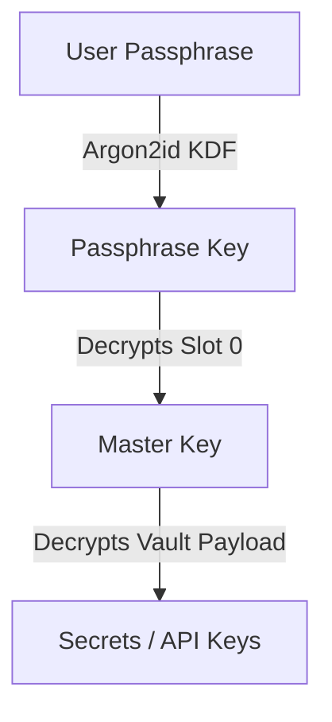
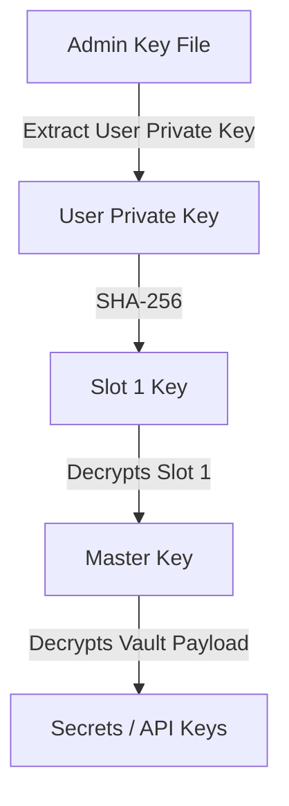
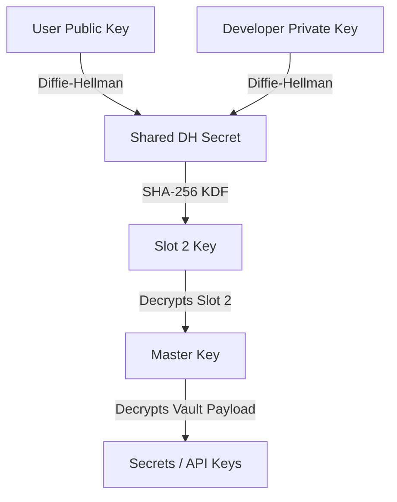

# Cryptographic Vault: Multi-Method Unlocking and Passphrase Recovery/Reset

We will enhance the Hydragent Cryptographic Vault with three distinct unlocking methods, a secure permission-slip model for passphrase changes, and an automated emergency recovery protocol using asymmetric cryptography (X25519 Diffie-Hellman and Ed25519 signatures).

---

## The Three Unlock Methods

### 1. Passphrase PIN (Remote-Friendly)
* **Usage:** For remote interfaces (Web, Telegram, Discord, etc.) where uploading a file is impossible.
* **Mechanism:** Unlocks Slot 0 using a standard passphrase PIN (via Argon2id key derivation).
* **Passphrase Change Rule:** The passphrase key is derived *only* from the passphrase itself (it does not use the Admin Key File as an ingredient). However, to prevent remote attackers from changing your passphrase, the **Admin Key File must be presented as a permission slip** to authorize setting or changing the passphrase in Slot 0.



---

### 2. Admin Key File (Local / Portable)
* **Usage:** When operating locally near the Hydragent.
* **Mechanism:** Unlocks Slot 1 using the User's Private Key stored in a portable key file (e.g., on a pendrive or backup directory).
* **Generation:** Generated from the Developer's Public Key and the User's Private Key.



---

### 3. Developer Private Key (Emergency Recovery)
* **Usage:** If the user completely loses their Admin Key File and Passphrase.
* **Mechanism:** The Developer performs a Diffie-Hellman key exchange between the **Developer's Private Key** and the **User's Public Key** (stored in the Vault metadata) to decrypt Slot 2.



---

## 🐣 Explain Like I'm 15: How the Developer Recovery Works

To understand how the Developer can unlock the vault without knowing your passphrase or having your key file, let's use the **Color Mixing Analogy** (Diffie-Hellman Key Exchange):

1. **Secret Colors (Private Keys):**
   * The **Developer** has a secret color: **Red** (Developer Private Key).
   * **You (the User)** have a secret color: **Blue** (User Private Key).
2. **Public Colors (Public Keys):**
   * Both you and the developer mix your secret colors with a common base color (yellow) and publish the result:
     * Developer publishes **Orange** (Developer Public Key).
     * You publish **Green** (User Public Key).
3. **The Magic Shared Secret:**
   * **You** take the Developer's public **Orange** and mix in your secret **Blue** $\rightarrow$ you get **Brown**.
   * **The Developer** takes your public **Green** and mixes in their secret **Red** $\rightarrow$ they also get **Brown**!
   * Anyone watching from the outside only sees the public colors (Orange and Green). It is mathematically impossible for them to make **Brown** because they don't have either secret color.
   * **This Brown color is used as the key to encrypt Slot 2.**

---

## ⚠️ The Security Risk & Mitigations (CRITICAL)

> [!CAUTION]
> **The Risk:** Because the Developer's Private Key (Red) can be combined with any user's Public Key (Green) to create that user's Shared Secret (Brown), **if the Developer's Private Key is ever leaked or stolen, the attacker can unlock ANY user's vault.**

To make the vault completely safe and protect against this risk, we implement the following mitigations:

### 1. Offline Cold Storage (Air-Gapped)
* The Developer's Private Key is **never** stored in the Hydragent code, nor is it stored on your computer.
* Only the Developer's **Public Key** is compiled into the program.
* The Developer keeps their Private Key in offline cold storage (like an air-gapped computer or hardware security key) that is never connected to the internet.

### 2. Optional Backdoor Opt-Out (User Choice)
* During first-time setup (`vault init` or `onboard`), the user will be asked:
  `Do you want to enable Developer Emergency Recovery? (Yes/No)`
* **If you choose No:** Slot 2 is left entirely empty and deactivated. The Developer's Public Key is discarded, and **it is cryptographically impossible for the developer (or anyone else) to ever unlock your vault** if you lose your keys.
* **If you choose Yes:** Slot 2 is activated, allowing recovery support.

---

## 🛡️ Automated Developer Recovery Protocol

To prevent an attacker from stealing a user's `vault.hvlt` file and tricking the developer into unlocking it (social engineering), we use a cryptographic **Recovery Identity Key (id_priv, id_pub)**.

### A. At Vault Initialization (Setup Time)
1. Generate a brand new Ed25519 signing keypair for the user: the **Recovery Identity Key (id_priv, id_pub)**.
2. Store `id_pub` in the vault metadata.
3. Save `id_pub` in the developer's registry database (mapping your user identity to your public signature key).
4. Give `id_priv` to the user as a **Recovery Mnemonic / Phrase** (something they write down and store in a physical, safe location separate from their computer).

### B. At Recovery Time (Emergency)
When the user forgets their passphrase and loses their `admin_key.bin` file:

```
                  USER SIDE                                       DEVELOPER SIDE
 (Has recovery phrase id_priv & vault.hvlt)                    (Offline air-gapped machine)
 
 1. Generate one-time session keypair (priv_r, pub_r)
 
 2. Build recovery request:
    request = { user_public_key, slot_2_ciphertext, pub_r, timestamp, nonce }
 
 3. Sign the request:
    signature = Sign(id_priv, request)
 
 4. Send { request, signature } ─────────────────────────> 5. Look up user's id_pub in records
                                                           6. Verify signature using id_pub
                                                              (checks timestamp & nonce to prevent replays)
                                                           7. shared1 = DH(dev_priv, user_public_key)
                                                              -> derives Slot2Key
                                                           8. MasterKey = Decrypt(Slot2Key, slot_2_ciphertext)
                                                           9. shared2 = DH(dev_priv, pub_r)
                                                              -> derives SessionKey
                                                          10. WrappedResponse = Encrypt(SessionKey, MasterKey)
                                                          11. Wipe MasterKey from memory
                                                          
 14. Use priv_r to derive same SessionKey:      <─────────12. Send WrappedResponse back
     SessionKey = DH(priv_r, dev_pub)
     
 15. MasterKey = Decrypt(SessionKey, WrappedResponse)
 
 16. Use MasterKey to decrypt vault payload,
     write new passphrase PIN, and generate 
     a new admin_key.bin file.
```

* **Security Advantage:** The developer never sees your master key in plaintext (it's encrypted under your session key `pub_r`), and the developer cannot be tricked because they automatically verify the request signature using your registered `id_pub`.

---

## Summary of Total Items & Files

### A. Vault Files
1. `vault.hvlt` (The main encrypted storage file containing the secrets).
2. `admin_key.bin` (The portable Admin Key File containing the User's Private Key).

### B. Keys Involved
1. **User Passphrase PIN** (Something the user knows; used for remote access).
2. **User Private Key** (Stored inside `admin_key.bin`; used for local access & recovery authorization).
3. **Recovery Mnemonic Phrase (`id_priv`)** (Written down by the user; used to sign recovery requests).
4. **Developer Public Key** (Embedded in the code; used to encrypt Slot 2).
5. **Developer Private Key** (Held securely by the developer; used for emergency decryption of Slot 2).

---

## Developer Keys

### Algorithm
- **Seed size:** 128 bytes = 256 hex characters (generated via CSPRNG)
- **Derivation:** SHA-256 applied to the seed blocks to derive X25519-equivalent recovery keys
- **Slot 2 key:** `SHA-256(DEVELOPER_PUBLIC_KEY_SEED || user_key_seed)`

### Developer Public Key (embed in code — safe to publish)

```
3a57d541f14be9b0594ac074a79a9ed039389a2977db757fdd57a4fefe70ebdc
0b8aad189a7fd981fa1436c8b13eaf65b5a04139434cddfcbff6dc1611d7b930
3a70d5cd83e7451e59f9217b7b490b1429f3cbc9940bd89a7a54045540746bdb
cc51e8a5fcca315c7880beb82cb4cf831ef97611d5e2821ec30a1d2ad583e9a4
```

> [!CAUTION]
> The **PRIVATE** key is stored in `config/security/dev_private_key.txt`.
> This file must be kept **OFFLINE in cold storage** and **NEVER committed to git or shared**.
> If this key is compromised, all vaults that enabled Developer Recovery are at risk.

### Vault Format

| Field | Value |
|-------|-------|
| Magic | `HVLT` |
| Version | `3` (V3) |

### Vault Slots

| Slot | Name | Unlock Method |
|------|------|---------------|
| Slot 0 | Passphrase PIN | Argon2id KDF from user passphrase; used for remote/interactive unlock |
| Slot 1 | Admin Key File | User's private key stored in `admin_key.bin`; used for local/portable unlock |
| Slot 2 | Developer Recovery | DH shared secret of Developer Private Key + User Public Key (emergency only) |

### CLI Commands

| Command | Description |
|---------|-------------|
| `vault init-v3` | Initialize a new V3 vault (generates all three slots + exports `admin_key.bin`) |
| `vault export-admin-key --output <path>` | Export the admin key file to a portable location |
| `vault recover-passphrase --key-file <path>` | Reset passphrase using `admin_key.bin` as authorization |
| `vault dev-recover --dev-key-file <path>` | Emergency developer recovery using `dev_private_key.txt` |

---

## Proposed Changes

### Vault Crate

#### [MODIFY] [Cargo.toml](file:///d:/Workspace/Hydragent/crates/hydragent-vault/Cargo.toml)
- Add `x25519-dalek = "2.0"` to dependencies to support standard, secure Diffie-Hellman key exchanges.

#### [MODIFY] [vault.rs](file:///d:/Workspace/Hydragent/crates/hydragent-vault/src/vault.rs)
- Update `VaultMetadataV2` (or upgrade to `VaultMetadataV3`) to include:
  - `user_public_key`: The 32-byte X25519 public key of the user.
  - `recovery_identity_pub`: The 32-byte Ed25519 public key (`id_pub`) of the user.
  - `slot_0`: Passphrase PIN Slot.
  - `slot_1`: Admin Key File Slot.
  - `slot_2`: Developer Recovery Slot (encrypted under DH shared secret of User Private Key and Developer Public Key).
- Implement `init_with_keys` to generate the User's X25519 keypair, export `admin_key.bin`, and populate Slots 0, 1, and 2.
- Implement `/vault recover` / `rotate_passphrase` checks requiring the presence of `admin_key.bin`.

---

### Core CLI Crate

#### [MODIFY] [main.rs](file:///d:/Workspace/Hydragent/crates/hydragent-core/src/main.rs)
- Update `VaultAction` subcommand enum to support:
  - `vault recover`: Prompts for `admin_key.bin` to authorize and write a new passphrase PIN to Slot 0.
  - `vault init`: Generates the vault, embeds the Developer's Public Key, and exports the `admin_key.bin` file.
  - `vault dev-decrypt <dev_private_key_path>`: Decrypts the vault using the developer's private key for emergency recovery.

---

## Verification Plan

### Automated Tests
- Add a new integration test verifying:
  - Vault initialization generating all three slots.
  - Decryption using Passphrase PIN (Slot 0).
  - Decryption using Admin Key File (Slot 1).
  - Decryption using Developer Private Key (Slot 2).
  - Resetting passphrase using Admin Key File.
  - Decryption failing if the admin key file is tampered with.
